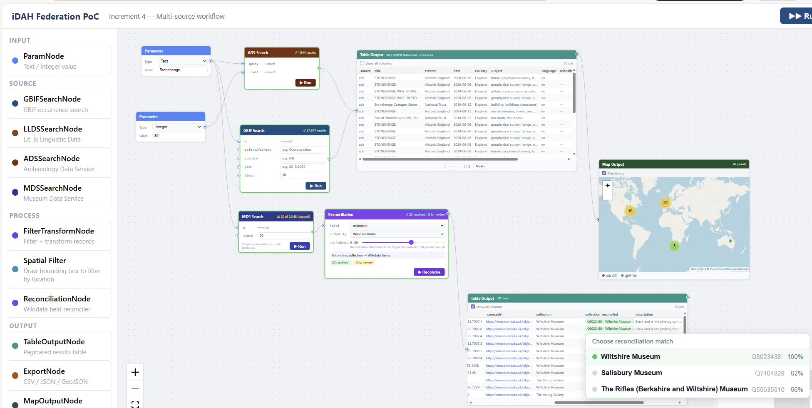

# iDAH Federation Workflow PoC

A node-based visual workflow editor for federating UK Arts & Humanities research data services. Built as part of the UKRI/AHRC Federation of Compute and Infrastructures programme.

Drag nodes onto a canvas, connect them in any order, and run federated searches across multiple heritage data services simultaneously. Records from different services are normalised to a common schema, can be filtered and transformed, reconciled against Wikidata authorities, and exported as CSV, JSON, or GeoJSON. Local document folders can be analysed with a locally-running LLM via Ollama. Web pages can be fetched, sectioned, and passed to an LLM for targeted extraction. Workflows can be saved to disk and reloaded.



---

## Prerequisites

- **Node.js** v18 or later ([nodejs.org](https://nodejs.org))
- **npm** v9 or later (bundled with Node)
- A modern browser — Chrome or Edge 86+ required for the **LocalFolderSourceNode** (File System Access API); all other nodes including **LocalFileSourceNode** work in Firefox too
- **[Ollama](https://ollama.com/)** running locally on port 11434 — required only for Ollama nodes
- **Puppeteer** (installed automatically via `npm install`) — required only for the **Wait for JS rendering** option in URLFetchNode; the headless browser runs inside the Vite dev server

---

## Installation

```bash
git clone https://github.com/kingsdigitallab/nfcs-poc.git
cd nfcs-poc
npm install
npm run dev
```

Open **http://localhost:5174** in your browser.

> The port is fixed at 5174 to avoid conflicts with other Vite projects.

---

## Saving and loading workflows

Click **💾 Save** in the top bar to download the current canvas as a `workflow-YYYY-MM-DD.json` file. This captures every node's position and configuration — query fields, filter/transform rules, Ollama prompts and settings, spatial bounding boxes, selectors, and ParamNode values.

Click **📂 Load** to restore a saved workflow. The canvas is replaced with the saved nodes and edges. All nodes start in an idle state with no results — run them again to repopulate data.

> **Note:** `LocalFolderSourceNode` folder handles and `LocalFileSourceNode` file handles cannot be serialised. After loading a workflow containing either, re-select the folder or file manually.

---

## Node types

The sidebar groups nodes into collapsible categories. Click a group heading to collapse or expand it. Drag any node onto the canvas to add it.

### Canvas

| Node | Description |
|------|-------------|
| **Comment** | A free-floating annotation label. Add a title and body text to document your workflow. No connectors. Select the node to reveal resize handles — drag any edge or corner to resize. |

### Input

| Node | Description |
|------|-------------|
| **ParamNode** | Holds a Text or Integer value. Connect its output handle to any search node input handle to inject a query parameter. |

### Search

| Node | Service | Notes |
|------|---------|-------|
| **GBIFSearchNode** | [GBIF Occurrence API](https://www.gbif.org/developer/occurrence) | Biodiversity specimens and observations. Direct browser fetch (permissive CORS). Inline fields: free-text `q`, `scientificName`, `country`, `year`, `limit`. |
| **LLDSSearchNode** | [Literary & Linguistic Data Service](https://llds.ling-phil.ox.ac.uk/) | DSpace REST API. Results filtered client-side. Uses a 24-hour localStorage cache; a **Use cache** toggle controls fallback during outages. |
| **ADSSearchNode** | [Archaeology Data Service](https://archaeologydataservice.ac.uk/) | Data Catalogue API. Returns archaeological datasets with spatial/temporal coverage. **Fetch all results** checkbox paginates automatically (50 records/request) to retrieve the complete result set. |
| **ADSSearchAdvancedNode** | [Archaeology Data Service](https://archaeologydataservice.ac.uk/) | Extended ADS search with faceted filters. Expands on ADSSearchNode with a collapsible **Filters** panel providing dropdowns for: **Resource type** (`ariadneSubject` — 16 values including Site/monument, Artefact, Coin, Fieldwork), **Getty AAT subject** (`derivedSubject` — freetext with top-20 suggestions), **Native subject** (`nativeSubject` — freetext with suggestions), **Country** (20 values), **Data type** (Structured Data, Still Image, Text, Geospatial, etc.), and **Period** (`temporal` — 20 values from post medieval to palaeolithic). A badge shows how many filters are active; a **Clear all filters** button resets them. Same sort, order, limit, and fetchAll options as the basic node. |
| **MDSSearchNode** | [museumdata.uk](https://museumdata.uk/) | HTML scraper (no public JSON API). Two-step fetch: probe for total, then retrieve all. Capped at 200 records; amber ⚠ badge when the total exceeds the cap. |
| **LocalFileSourceNode** | Local filesystem | Parses a single CSV or TSV file selected via a standard file picker (works in all browsers). Auto-detects the delimiter from the file extension and content (tab, comma, semicolon, or pipe); manual override available. **First row is header** toggle (default on) — off generates `col1`, `col2`… names. **Cast numeric strings to numbers** toggle (default on) — converts values such as `"51.5074"` to `51.5074`, enabling downstream map and spatial filter nodes to work directly with coordinate columns. Shows a column name preview after parsing. |
| **LocalFolderSourceNode** | Local filesystem | Reads files from a user-selected folder via the [File System Access API](https://developer.mozilla.org/en-US/docs/Web/API/File_System_API). Supports PDF (text extraction via pdfjs-dist), XML/TEI, plain text, and images. Also detects Shapefiles and GeoJSON files in the folder and exposes them via a dedicated **GIS handle** (bottom) — connect this to a MapOutputNode to overlay vector layers on the map. Emits `FileRecord[]` on the main output. Requires Chrome or Edge 86+. |

### Process

Process nodes sit between source nodes and output nodes. They read upstream records, transform or reduce them, and pass the augmented array downstream.

| Node | Description |
|------|-------------|
| **FilterTransformNode** | Filters records by condition and/or mutates field values. See [Filter / Transform](#filter--transform) below. |
| **SpatialFilterNode** | Draws a bounding box on an interactive map; filters upstream records to those within the bbox. Only records with `decimalLatitude` / `decimalLongitude` are kept. |
| **ReconciliationNode** | Reconciles a chosen field against a Wikidata authority. See [Reconciliation](#reconciliation) below. |
| **OllamaNode** | Sends each upstream record to a locally-running [Ollama](https://ollama.com/) instance and enriches the record with the model's response. Supports vision models. See [Local LLM analysis](#local-llm-analysis) below. |
| **OllamaFieldNode** | Sends a single chosen field to Ollama in **per-record** or **aggregate** mode. Lighter-weight than OllamaNode when you only need one field processed. |
| **URLFetchNode** | Follows a URL field in each record, fetches the page (optionally via headless browser for JS-rendered pages), and adds `fetchedContent` (plain text) and `fetchedHtml` (structured HTML) to each record. |
| **HTMLSectionNode** | Extracts a specific section from `fetchedHtml` using a CSS selector. A **structure picker** shows detected landmarks and headings. Toggle **Preserve HTML structure** to write the matched element's raw HTML into `fetchedContent` instead of plain text — useful when passing structured markup to an LLM for extraction. |

### Output

| Node | Description |
|------|-------------|
| **QuickViewNode** | Inspect the full, untruncated value of any field across upstream records. Pick a field from the dropdown; navigate records with ‹ / › buttons. Copy button per record. Useful for reviewing long fields such as `fetchedContent` or `ollamaResponse`. |
| **TableOutputNode** | Paginated table. Merges records from multiple upstream nodes automatically. Pass-through output handle so it can chain into Map, Timeline, or Export nodes. Double-click to expand to a full-screen panel. |
| **JSONOutputNode** | Syntax-highlighted JSON viewer. Shows the full normalised record graph. Double-click to expand. |
| **MapOutputNode** | Leaflet map. Plots any record that has `decimalLatitude` and `decimalLongitude`. Click a marker for a popup with title, date, and a link back to the source record. Also accepts GIS vector layers via the **GIS handle** (connect from `LocalFolderSourceNode`'s bottom handle) and renders them as overlays alongside point data. |
| **TimelineOutputNode** | SVG horizontal timeline at year resolution. Handles ISO dates, bare years, and BCE dates (e.g. `-1199`). Hover a marker for details. |
| **ExportNode** | Downloads the upstream records as **CSV**, **JSON**, or **GeoJSON**. See [Export](#export) below. |
| **OllamaOutputNode** | Card-based display of Ollama inference text. Each record gets its own expandable card with a copy button. |

---

## Data flow

```
ParamNode ─┐
           ▼
  GBIFSearchNode       ────────────────────────────────────────┐
  LLDSSearchNode       ────────────────────────────────────────┤
  ADSSearchNode        ──┐                                     │
  ADSSearchAdvancedNode ─┤                                     │
  MDSSearchNode        ──┤                                     │
  LocalFileSourceNode  ──┤                                     │
                         ▼                                     │
               FilterTransformNode ────────────────────────────┤
                         │                                     │
                         ▼                                     │
               SpatialFilterNode   ────────────────────────────┤
                         │                                     │
                         ▼                                     │
               ReconciliationNode  ────────────────────────────┤
                                                               │
  LocalFolderSourceNode ──► OllamaNode ──────────────────────── ┤
           │ (GIS handle)                                      │
           ▼                                                   │
  [source] ──► URLFetchNode ──► HTMLSectionNode ──► OllamaFieldNode ──┤
                                                               ▼
                                                      TableOutputNode ──► ExportNode
                                                      QuickViewNode
                                                      JSONOutputNode
                                                      MapOutputNode ◄── LocalFolderSourceNode (GIS)
                                                      TimelineOutputNode
                                                      OllamaOutputNode
```

All data nodes expose a **`data` input handle** (left) and a **`results` output handle** (right). You can chain them in any order and branch to multiple output nodes simultaneously. Comment nodes have no handles.

The `useUpstreamRecords` hook merges records from **all** edges connected to a node's input handle, so a single Table or Map node can aggregate several source nodes at once.

---

## Execution model

- **▶ Run** (on individual nodes) — execute that node only.
- **▶▶ Run All** (top bar) — discovers every runnable node, builds a topological order using Kahn's algorithm, and executes nodes wave-by-wave: all source nodes in parallel first, then each processing layer in dependency order. If one node errors, downstream dependants are skipped but unrelated branches continue.

All node types are included in Run All **except** `LocalFolderSourceNode` and `LocalFileSourceNode` (file/folder selection requires a user gesture and cannot be automated). Run those nodes manually before clicking Run All.

Per-record failures in Ollama nodes do not abort the batch — the error is stored as `ollamaResponse` on that record and processing continues with the next record.

---

## The UnifiedRecord schema

Every adapter maps its raw API response to `UnifiedRecord` before writing to the canvas. Output nodes consume only `UnifiedRecord[]` — they never touch raw responses.

```
id            — globally unique, service-prefixed: "gbif:12345", "ads:1862953"
_source       — service identifier: "gbif" | "llds" | "ads" | "mds"
_sourceId     — native record ID within the service
_sourceUrl    — link back to the record in the service's own UI
_pid          — persistent identifier (DOI, Handle, ARK) when available
_cached       — true when served from localStorage cache

title         — best available display title
description   — abstract or description
creator       — author(s) — string or string[]
date          — publication or event date
subject       — subject keywords — string or string[]
language      — language code, e.g. "en"
type          — resource type, e.g. "Dataset", "Text"

scientificName, country, eventDate          — GBIF-specific normalised fields
decimalLatitude, decimalLongitude           — used by MapOutputNode
basisOfRecord, institutionCode, datasetName — GBIF-specific

gbif.*   — full raw GBIF occurrence object
llds.*   — LLDS handle, branding, itemType
ads.*    — ADS temporal, country, spatial, identifier namespace
mds.*    — MDS field map (condition, materials, dimensions, provenance, …)

fetchedUrl, fetchedContent, fetchedHtml, fetchStatus, fetchedAt  — added by URLFetchNode
htmlSelector                                                      — added by HTMLSectionNode
ollamaModel, ollamaPrompt, ollamaResponse, ollamaProcessedAt      — added by OllamaNode / OllamaFieldNode
```

After reconciliation, records also carry `${fieldName}_reconciled` keys (see below).

**Note:** `LocalFolderSourceNode` emits `FileRecord[]` rather than `UnifiedRecord[]`. `FileRecord` is a parallel type with fields `id`, `filename`, `path`, `contentType`, `content`, `mimeType`, `sizeBytes`, `sourceFolder`. These records flow through `OllamaNode` and are rendered correctly by `TableOutputNode` via dynamic column detection.

---

## Filter / Transform

**FilterTransformNode** operates in three modes (selectable via tabs):

### Filter mode

Add one or more filter rows. Each row specifies:
- **Field** — any string field from the upstream records
- **Operator** — `contains`, `=`, `starts with`, `>`, `<`, `is empty`, `not empty`
- **Value** — text or number (hidden for `is empty` / `not empty`)

Multiple rows are combined with an **AND / OR** toggle.

### Transform mode

Add one or more transform operations applied in order:

| Operation | What it does |
|-----------|--------------|
| **Rename field** | Copies a field to a new key. Optional **drop** checkbox removes the original. |
| **Lowercase / Uppercase** | In-place case conversion. Array values are converted element-by-element. |
| **Truncate** | Trims a field to a maximum character length and appends `…`. |
| **Extract** | Slices a substring by start/end index, or captures a regex match (group 1 if present). Writes to a new field. |
| **Concatenate** | Merges two fields into a new key with a configurable separator. |

### Both mode

Filter runs first, then transforms are applied to the reduced set.

---

## Reconciliation

**ReconciliationNode** enriches a chosen field by matching its unique values against a Wikidata authority in a single batched POST to the [W3C Reconciliation API](https://www.w3.org/community/reports/reconciliation/CG-FINAL-specs-0.2-20230410/).

1. Connect an upstream node to the `data` handle.
2. Select the **field** to reconcile (dropdown populated from the first upstream record).
3. Select the **authority**:

| Field | Authorities |
|-------|-------------|
| `creator` | Wikidata People (Q5) |
| `country`, `spatialCoverage` | Wikidata Places (Q618123) |
| `scientificName`, `species`, `genus` | Wikidata Taxa (Q16521) |
| `subject`, `title` | Wikidata Items |
| `institutionCode` | Wikidata Organisations (Q43229) |
| *(any other field)* | Wikidata Items |

4. Set the **confidence threshold** (0.5–1.0, default 0.8).
5. Click **▶ Reconcile**.

Each augmented record gains a `${fieldName}_reconciled` key. In **TableOutputNode**, reconciled cells render as coloured pills — green (resolved, confidence ≥ threshold) or amber (below threshold, flagged for review). The QID is a clickable link to `wikidata.org`.

---

## Local LLM analysis

### OllamaNode

**OllamaNode** sends each upstream record to a locally-running [Ollama](https://ollama.com/) instance and enriches the record with the model's response.

#### Setup

1. Install and start Ollama: `ollama serve`
2. Pull a model: e.g. `ollama pull llama3.2` or `ollama pull gemma3:4b`
3. The node auto-fetches available models on load and populates the dropdown.

#### Configuration

| Setting | Description |
|---------|-------------|
| **Model** | Dropdown of models available in your local Ollama instance. |
| **Vision model** | Checkbox — tick this if your model supports image inputs (e.g. `llava`). Models whose names contain `llava`, `vision`, `bakllava`, `moondream`, or `cogvlm` are auto-detected. |
| **System prompt** | Instruction context sent before the user message. |
| **Prompt template** | User message with `{{fieldName}}` placeholders. Click **▼ fields** to see available substitution tokens from the first upstream record. |
| **Temp** | Temperature slider (0.0–1.0). |
| **Tokens** | Maximum tokens to generate (`-1` for no limit). Clear the field and type a new value; the setting is committed when you leave the field. |

Processing is sequential per record. Generation stops as soon as the model finishes naturally — the Tokens setting is a ceiling, not a target, so responses that terminate cleanly are not padded to the limit.

### OllamaFieldNode

A lighter-weight alternative when you only need to process a single field.

**Template variables:**

| Token | Value |
|-------|-------|
| `{{value}}` | The content of the selected field for this record |
| `{{field}}` | The name of the selected field (e.g. `fetchedHtml`) |
| `{{anyFieldName}}` | The value of any other field on the same record |

**Per-record mode**: each record's chosen field value is sent individually; the response is stored as `ollamaResponse` on that record.

**Aggregate mode**: all field values from all records are collected and sent in one prompt using `{{values}}` (newline-joined), `{{count}}` (number of records), and `{{field}}`.

---

## URL fetching and section extraction

### URLFetchNode

Follows a URL field in each upstream record and fetches the page content, adding:
- `fetchedContent` — plain text extracted from the cleaned page body
- `fetchedHtml` — the cleaned body HTML (noise elements removed: scripts, nav, footer, etc.)

**Options:**
- **URL field** — auto-detected from fields whose name contains `url`, `link`, `href`, `uri`, or `pid`, or whose value starts with `http`; falls back to a manual input.
- **Wait for JS rendering** — uses a headless browser (Puppeteer) inside the Vite dev server. The first JS-render request launches the browser; subsequent requests reuse it.
- **Wait for** — load event: `Network quiet (2 req)` (default), `Network fully idle`, or `DOM ready only`.
- **Max chars** — truncation limit for `fetchedContent` (default 8 000).
- **Timeout** — per-URL timeout in seconds (simple fetch path only).

### HTMLSectionNode

Extracts a targeted section from `fetchedHtml` using a CSS selector, writing the result into `fetchedContent`. Connect URLFetchNode → HTMLSectionNode → OllamaFieldNode for precise targeted extraction.

**Workflow:**
1. Connect URLFetchNode output to HTMLSectionNode input and run URLFetchNode.
2. Click **▼ Pick from page structure** to see detected landmarks and headings from the first fetched record.
3. Click any item to populate the selector, or type a custom CSS selector directly.
4. Toggle **Preserve HTML structure** if you need the raw HTML of the matched element (e.g. to pass a `<dl>` to an LLM for structured key/value extraction) rather than stripped plain text.
5. The **live preview** shows what the selector would extract from the first record (labelled **HTML** or **text** depending on the mode).
6. Click **▶ Extract Sections**.

---

## Export

**ExportNode** downloads the upstream records. Select format from the dropdown:

| Format | Description |
|--------|-------------|
| **CSV** | Flat table, one row per record. `*_reconciled` objects are expanded to `_qid`, `_label`, `_confidence`, `_status` columns. Namespace objects (`gbif`, `llds`, `ads`, `mds`) are excluded. |
| **JSON** | Full record graph as a pretty-printed JSON array. |
| **GeoJSON** | `FeatureCollection` of records that have both `decimalLatitude` and `decimalLongitude`. |

Files are named `nfcs-export-YYYY-MM-DD.{ext}`.

---

## CORS and the dev proxy

| Prefix | Target | Reason |
|--------|--------|--------|
| `/llds-proxy/…` | `https://llds.ling-phil.ox.ac.uk/llds/…` | No CORS |
| `/ads-proxy/…` | `https://archaeologydataservice.ac.uk/…` | No CORS |
| `/mds-proxy/…` | `https://museumdata.uk/…` | No CORS |
| `/reconcile-proxy/…` | `https://wikidata.reconci.link/…` | 307 redirect strips CORS headers in browser |
| `/ollama/…` | `http://localhost:11434/…` | Avoids cross-port CORS for local Ollama |
| `/url-proxy?url=…` | *any URL* | Vite middleware; sidesteps CORS for arbitrary URL fetching |

> **Production note:** This proxy is development-only. For a deployed instance, replace each rule with a lightweight server-side proxy.

---

## Usage examples

### Federated search across two services

1. Drag a **GBIFSearchNode** and an **ADSSearchNode** onto the canvas.
2. Type `Stonehenge` into the inline query fields on both.
3. Drag a **TableOutputNode** and connect both search node outputs to its input.
4. Click **▶▶ Run All**.

### Local document analysis

1. Drag a **LocalFolderSourceNode** → **OllamaNode** → **TableOutputNode** onto the canvas and connect them.
2. Click **📂 Pick Folder** on the LocalFolderSourceNode and select a folder of PDFs, TEI-XML files, or images.
3. On the OllamaNode, select your model and tick **Vision model** if using images.
4. Click **▶ Run** on the LocalFolderSourceNode, then **▶▶ Run All**.

### Web content extraction and LLM analysis

1. Run a source node (e.g. ADS or MDS) to get records with `_sourceUrl` fields.
2. Add a **URLFetchNode**, connect the source output to its input, select the URL field, and click **▶ Fetch URLs**.
3. Add an **HTMLSectionNode**, connect URLFetchNode's output, choose a CSS selector via the structure picker, and optionally enable **Preserve HTML structure** for markup-aware extraction. Click **▶ Extract Sections**.
4. Add an **OllamaFieldNode**, connect HTMLSectionNode's output, select `fetchedContent`, write a prompt using `{{value}}` for the field content, and click **▶ Run**.
5. Add a **QuickViewNode** connected to OllamaFieldNode to inspect individual responses in full, or a **TableOutputNode** for the complete record set.

### Parsing a CSV with coordinates

1. Drag a **LocalFileSourceNode** onto the canvas.
2. Ensure **Cast numeric strings to numbers** is ticked (default).
3. Click **📂 Pick File** and select your CSV. The column names preview confirms the parse.
4. Connect the output to a **MapOutputNode** — if your CSV has columns named `decimalLatitude` / `decimalLongitude` (or rename them first with a **FilterTransformNode**), points will appear immediately.

### Advanced ADS faceted search

1. Drag an **ADSSearchAdvancedNode** onto the canvas.
2. Type a keyword query (e.g. `Hadrian`) or leave it blank for a browse.
3. Click **▸ Filters** to expand the panel and select, e.g., **Resource type = Fieldwork report**, **Country = Scotland**, **Period = roman**.
4. Optionally tick **Fetch all results** for a complete paginated result set.
5. Click **▶ Run** and connect the output to a **TableOutputNode** or **MapOutputNode**.

### Spatial filter + map

1. Run any source node.
2. Connect to a **SpatialFilterNode** and draw a bounding box over the region of interest.
3. Connect its output to a **MapOutputNode**. Only records inside the bbox are plotted.

### Species reconciliation workflow

1. Run a **GBIFSearchNode**.
2. Connect to a **ReconciliationNode** — field `scientificName`, authority `Wikidata Taxa`.
3. Connect to **TableOutputNode** and **ExportNode** (GeoJSON) for download.

---

## Project structure

```
nfcs-poc/
├── CLAUDE.md                   # Architecture notes and API references (dev only)
├── vite.config.ts              # Dev server + CORS proxy rules + /url-proxy middleware
└── src/
    ├── App.tsx                 # Canvas, collapsible sidebar, Run All, save/load, node factories
    ├── types/
    │   └── UnifiedRecord.ts    # Canonical cross-service record type
    ├── store/
    │   └── resultsStore.ts     # Out-of-band record store (avoids React Flow state bloat)
    ├── hooks/
    │   └── useUpstreamRecords.ts   # Reactive multi-source merge hook
    ├── nodes/
    │   ├── index.ts                # nodeTypes registry
    │   ├── ParamNode.tsx
    │   ├── CommentNode.tsx         # Canvas annotation label (no handles, resizable)
    │   ├── GBIFSearchNode.tsx
    │   ├── LLDSSearchNode.tsx
    │   ├── ADSSearchNode.tsx           # Includes fetchAll pagination
    │   ├── ADSSearchAdvancedNode.tsx   # ADS search with faceted filters
    │   ├── MDSSearchNode.tsx
    │   ├── LocalFileSourceNode.tsx     # Single CSV/TSV file picker with delimiter detection
    │   ├── LocalFolderSourceNode.tsx   # File System Access API source + GIS layer output
    │   ├── FilterTransformNode.tsx
    │   ├── SpatialFilterNode.tsx       # Leaflet bbox filter
    │   ├── ReconciliationNode.tsx
    │   ├── OllamaNode.tsx              # Local LLM transform
    │   ├── OllamaFieldNode.tsx         # Single-field LLM inference (per-record / aggregate)
    │   ├── OllamaOutputNode.tsx        # Card display for Ollama responses
    │   ├── URLFetchNode.tsx            # URL fetch + HTML cleaning
    │   ├── HTMLSectionNode.tsx         # CSS selector section extraction; text or HTML output
    │   ├── QuickViewNode.tsx           # Full-value field inspector with record navigation
    │   ├── ReconciledCell.tsx          # Shared QID pill component
    │   ├── TableOutputNode.tsx
    │   ├── JSONOutputNode.tsx
    │   ├── MapOutputNode.tsx
    │   ├── TimelineOutputNode.tsx
    │   ├── ExportNode.tsx
    │   └── ExpandedOutputPanel.tsx
    └── utils/
        ├── nodeIdCounter.ts            # Shared ID counter; bumpCounterPast() used on workflow load
        ├── workflowIO.ts               # Serialize/deserialize workflow to/from JSON
        ├── fileReaders.ts              # PDF/XML/text/image extraction (FileRecord)
        ├── gisReaders.ts               # Shapefile + GeoJSON parsing via shpjs (GisLayer)
        ├── gbifAdapter.ts
        ├── lldsAdapter.ts / lldsCache.ts
        ├── adsAdapter.ts
        ├── mdsAdapter.ts
        ├── reconciliationService.ts    # W3C Reconciliation API client
        ├── filterTransformUtils.ts
        ├── exportUtils.ts
        ├── runGBIFNode.ts
        ├── runLLDSNode.ts
        ├── runADSNode.ts               # fetchAll pagination loop
        ├── runADSAdvancedNode.ts        # Advanced ADS search with facet params
        ├── runMDSNode.ts
        ├── runReconciliationNode.ts
        ├── runFilterTransformNode.ts
        ├── runSpatialFilterNode.ts
        ├── runHTMLSectionNode.ts
        ├── runURLFetchNode.ts          # Runner for urlFetch
        ├── runOllamaNode.ts            # Runner for ollamaNode
        ├── runOllamaFieldNode.ts       # Runner for ollamaField
        ├── nodeRunners.ts              # Registry: node type → runner
        └── runWorkflow.ts              # Topological executor (Kahn's algorithm)
```

---

## Tech stack

| Library | Purpose |
|---------|---------|
| [Vite](https://vitejs.dev/) | Dev server, bundler, CORS proxy |
| [React 19](https://react.dev/) + [TypeScript](https://www.typescriptlang.org/) | UI framework |
| [@xyflow/react v12](https://reactflow.dev/) | Node-based canvas |
| [Leaflet](https://leafletjs.com/) | Map rendering (MapOutputNode, SpatialFilterNode) |
| [pdfjs-dist](https://mozilla.github.io/pdf.js/) | Client-side PDF text extraction (LocalFolderSourceNode) |
| [shpjs](https://github.com/calvinmetcalf/shapefile-js) | Client-side Shapefile parsing for GIS layer support (LocalFolderSourceNode) |
| [Puppeteer](https://pptr.dev/) | Headless browser for JS-rendered page fetching (URLFetchNode) |
| [Ollama](https://ollama.com/) | Local LLM inference (external, not bundled) |

No backend. No database. No authentication. All API calls are made directly from the browser (or via the Vite dev proxy for services without permissive CORS).
