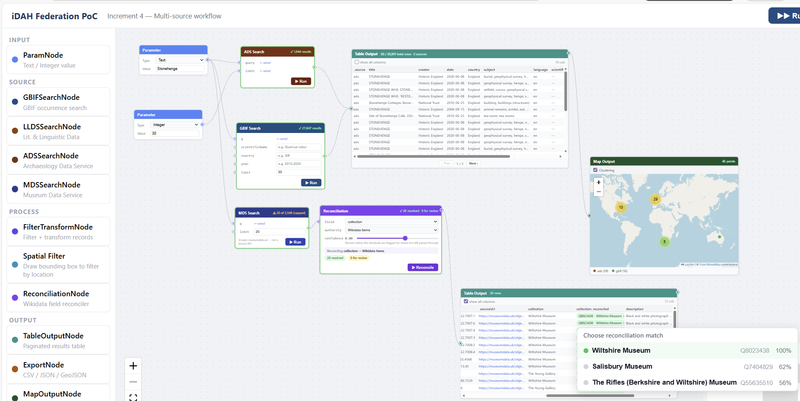

# National Federated Compute Services – Arts & Humanities

**Proof of Concept. V2.0**

A node-based visual workflow editor for federating UK Arts & Humanities research data services. Built as part of the UKRI/AHRC Federation of Compute and Infrastructures programme. Conceptualised by Neil Jakeman, King's Digital Lab.

Drag nodes onto a canvas, connect them in any order, and run federated searches across multiple heritage data services simultaneously. Records from different services are normalised to a common schema, can be filtered and transformed, reconciled against Wikidata authorities, enriched with AI inference, and exported as CSV, JSON, or GeoJSON. Local document folders and images can be analysed using KCL's hosted inference API or a locally-running LLM via Ollama. IIIF manifests can be browsed and annotated with region markers, with cropped image snippets passed directly to inference models. Workflows can be saved to disk and reloaded.



---

## Prerequisites

- **Node.js** v18 or later ([nodejs.org](https://nodejs.org))
- **npm** v9 or later (bundled with Node)
- A modern browser — Chrome or Edge 86+ required for the **LocalFolderSourceNode** (File System Access API) and for the native save dialog in **SaveSearchNode** (falls back to an automatic download on Firefox); all other nodes work in Firefox too
- **KCL Inference API key** — required only for KingsInference nodes; request access from King's Digital Lab
- **[Ollama](https://ollama.com/)** running locally on port 11434 — required only for Ollama nodes (hidden from sidebar by default; use KingsInference for hosted inference)
- **Puppeteer** (installed automatically via `npm install`) — required only for the **Wait for JS rendering** option in URLFetchNode; the headless browser runs inside the Vite dev server

---

## Installation

```bash
git clone https://github.com/kingsdigitallab/nfcs-poc.git
cd nfcs-poc
npm install
npm run dev
```

Open **http://localhost:5174** in your browser.

> The port is fixed at 5174 to avoid conflicts with other Vite projects.

---

## Saving and loading workflows

Click **💾 Save** in the top bar to download the current canvas as a `workflow-YYYY-MM-DD.json` file. This captures every node's position and configuration — query fields, filter/transform rules, prompts and settings, spatial bounding boxes, selectors, and ParamNode values.

Click **📂 Load** to restore a saved workflow. The canvas is replaced with the saved nodes and edges. All nodes start in an idle state with no results — run them again to repopulate data.

> **Note:** `LocalFolderSourceNode` folder handles and `LocalFileSourceNode` file handles cannot be serialised. After loading a workflow containing either, re-select the folder or file manually.

---

## Node types

The sidebar groups nodes into collapsible categories. Click a group heading to collapse or expand it. Drag any node onto the canvas to add it.

### Canvas

| Node | Description |
|------|-------------|
| **QuickStart** | AI workflow planner. Describe a research question in plain English; the node calls the KCL inference API (`arc:nexus`) and returns a structured plan listing the most appropriate data service nodes, suggested queries, and commentary on source relevance. Click **Instantiate workflow** to place all recommended nodes on the canvas — search nodes, a **SourceProfile** for each source (or a shared **Deduplicate** → **SourceProfile** chain when multiple nodes of the same type are suggested), and **TableOutput** / **MapOutput** as appropriate. Wiring is created automatically. No handles — this node is a standalone planner. Requires a KCL API key. |
| **Comment** | A free-floating annotation label. Add a title and body text to document your workflow. No connectors. Select the node to reveal resize handles — drag any edge or corner to resize. |

### Input

| Node | Description |
|------|-------------|
| **Param** | Holds a Text or Integer value. Connect its output handle to any search node input handle to inject a query parameter (e.g. wire a single query string into multiple search nodes at once). |

### Inspection

| Node | Description |
|------|-------------|
| **QuickView** | Inspect the full, untruncated value of any field across upstream records. Pick a field from the dropdown; navigate records with ‹ / › buttons. Copy button per record. CSV/TSV values are paginated (50 rows per page). Large plain-text values are truncated at 50 000 chars. |
| **ImageView** | Resizable image viewer with two modes and a source output handle for piping images to inference nodes. **Images mode** — combobox field picker (type any dot-notation path, e.g. `europeana.thumbnail`; the dropdown suggests fields found in upstream records); a separate **URL** row accepts any public image URL directly (overrides the field picker when set). **IIIF mode** — accepts a IIIF Presentation API v2 or v3 manifest URL (pre-loaded with a Wellcome Collection example); navigates canvases with ‹ / › buttons; zoom-tiered resolution requests via IIIF Image API. See [ImageView and IIIF region annotation](#imageview-and-iiif-region-annotation). |
| **HTMLPreview** | Renders `fetchedHtml` from upstream records in a sandboxed iframe with a lightweight readability stylesheet. Click any element in the preview to capture its CSS selector — the selector is sent back to the parent page and can be pasted directly into an HTMLExtract node. Two modes: **Captured** (reads stored `fetchedHtml` from the results store) and **Live** (fetches the URL field of each record in real time). |
| **SourceProfile** | Displays the authored schema profile for any connected data source, enriched with runtime field statistics computed from the actual upstream records. Shows: source coverage and limitations; a completeness bar (`retrieved / total API results`); a field table sorted by population rate with expandable sample values from real records; cross-source correspondence hints (which fields can be joined or compared across sources). An optional **AI Narrative** section (KCL API key + model required) builds a structured prompt from all schema and completeness data and streams a research-quality assessment — provide a research question for a focused response. Drag the output handle to pass records through to any downstream node. Defaults to `arc:nano`; max tokens configurable (default 16 384) under **Advanced**. |

### Data Services

All active search nodes share a **fixture mode** for offline and workshop use — see [Offline fixtures](#offline-fixtures) below.

| Node | Service | Notes |
|------|---------|-------|
| **ARIADNESearch** | [ARIADNE Infrastructure Portal](https://portal.ariadne-infrastructure.eu/) | Pan-European archaeology data aggregator covering 40+ institutions across 23 countries. Direct browser fetch (permissive CORS). Inline fields: keyword query, limit, sort/order, and **Fetch all results** (paginates at 50 records/request). Collapsible **Filters** panel provides dropdowns for **Resource type**, **Getty AAT subject**, **Native subject**, **Country**, **Data type**, **Period**, and **Contributor** (e.g. "Archaeology Data Service" to retrieve ADS records specifically). Citation metadata stamped on every record. |
| **HSDSSearch** | [Historic Environment Data Service](https://hsds.ac.uk/) | UK historic environment data service aggregating records from Historic England, Historic Environment Scotland, Cadw (Wales), and other national bodies. Fetched via Vite proxy (no Cloudflare protection). Inline fields: keyword query, limit, sort/order, and **Fetch all results** (paginates at 50 records/request). Collapsible **Filters** panel: **Resource type**, **Getty AAT subject**, **Native subject**, **Country** (England/Scotland/Wales/Northern Ireland/Isle of Man), **Data type**, **Period**, and **Contributor**. Records include `hsds.*` namespace with landingPage, contributor, temporal, spatial, and subject arrays. Best for: scheduled monuments, listed buildings, UK historic environment records, built heritage, maritime archaeology. |
| **BodleianSearch** | [Bodleian Digital Collections](https://digital.bodleian.ox.ac.uk/) | Oxford's digital collections portal covering manuscripts, printed books, maps, photographs, coins, musical scores, and more. Inline fields: plain keyword query (e.g. `psalter`), limit (default 20), and sort order. Collapsible **Filters** panel: date range (from/to year), language (e.g. `Latin`), place of origin (e.g. `England`), completeness (fully digitised / partial), and musical notation presence. Records include `bodleian.*` namespace with shelfmark, date range, and IIIF manifest URL — connect output to **ImageView** in IIIF mode to browse manuscripts directly on the canvas. Fixture mode supported. |
| **EuropeanaSearch** | [Europeana](https://www.europeana.eu/) | Pan-European cultural heritage aggregator covering museums, galleries, libraries and archives. Direct browser fetch (permissive CORS). API key is pre-configured (🔒 Configured); wire a **Param** node to the `apiKey` handle to override with your own key from [apis.europeana.eu](https://apis.europeana.eu/apikey). Inline fields: `query`, `limit` (up to 1 000 records via cursor-based pagination). Filters: Type, Reusability, media only. Records include `europeana.*` namespace with thumbnail, shownAt (original institution URL), rights, provider, and completeness. |
| **GBIFSearch** | [GBIF Occurrence API](https://www.gbif.org/developer/occurrence) | Biodiversity specimens and observations. Direct browser fetch (permissive CORS). Inline fields: free-text `q`, `scientificName`, `country`, `year`, `limit`. |
| **LLDSSearch** | [Literary & Linguistic Data Service](https://llds.ling-phil.ox.ac.uk/) | DSpace REST API. Results filtered client-side. Uses a 24-hour localStorage cache; a **Use cache** toggle controls fallback during outages. |
| **MDSSearch** | [museumdata.uk](https://museumdata.uk/) | HTML scraper (no public JSON API). Capped at 200 records; amber ⚠ badge when the total exceeds the cap. |
| **SMGSearch** | [Science Museum Group](https://collection.sciencemuseumgroup.org.uk/) | Digital collection covering science, technology, medicine, and social history. Records include `smg.manifest` (IIIF) — connect to ImageView for object browsing. Fixture mode supported. |
| **VASearch** | [Victoria & Albert Museum](https://api.vam.ac.uk/) | V&A Collection API v2. Filters: images only, object type, year made from/to. Records include `vam.manifest`, `vam.iiifImageBase`, `vam.thumbnail`, `vam.place`, `vam.objectType`, `vam.onDisplay`. |
| **LoadSavedSearch** | Local filesystem | Loads a `.nfcs.json` file saved by **SaveSearch**, or any raw `UnifiedRecord[]` JSON array exported by **Export**. Displays full provenance metadata: saved date/time, source breakdown with per-service record counts, and the original search parameters in a collapsible panel. |
| **LocalFileSource** | Local filesystem | Parses a single CSV, TSV, XML, or image file selected via a standard file picker (all browsers). Auto-detects the delimiter. **Cast numeric strings to numbers** toggle converts coordinate strings to floats. |
| **LocalFolderSource** | Local filesystem | Reads files from a user-selected folder via the [File System Access API](https://developer.mozilla.org/en-US/docs/Web/API/File_System_API). Supports PDF (text extraction), XML/TEI, plain text, images, Shapefiles, and GeoJSON. Five typed output handles: `results` (all), `pdf`, `xml`, `text`, `image`, plus a **GIS handle** for Shapefile/GeoJSON layers. Requires Chrome or Edge 86+. |
| **FrameSenseSource** | Local filesystem | Reads a folder pre-processed by the [FrameSense](https://github.com/kingsdigitallab/framesense) CLI and emits one record per shot. Each record carries the representative frame as an `imageDataUrl` (base64 JPEG), enabling direct vision inference via **KingsInference**. Existing FrameSense analysis (shot scale classifications from `scale_frames_sssabet`, VLM answers from `answer_frames_vlm`) is surfaced as `framesense.*` fields. See [FrameSense workflows](#framesense-workflows) below. |
| ~~**ADSSearchAdvanced**~~ *(deprecated)* | Archaeology Data Service | **Currently unavailable** — blocked by Cloudflare. Use **ARIADNESearch** with `Contributor = Archaeology Data Service`. |
| ~~**ADSLibrary**~~ *(deprecated)* | ADS Library catalogue | **Currently unavailable** — blocked by Cloudflare. |

### Filters and Transforms

| Node | Description |
|------|-------------|
| **FieldDistribution** | Faceted bar chart of value frequencies for any field. Click bars to toggle them as filters — matching records are emitted on the output handle and update live as upstream data changes. Array-valued fields (`subject`, `country`, `creator`) are expanded so each element is tallied individually. Bars sorted by count descending, capped at a configurable Top N. A status bar shows how many records match the current selection with a **✕ clear** button. |
| **SmartFilter** | Natural language → structured filter. Type a plain-English filter request (e.g. *"Iron Age sites in England with coordinates"*, *"objects made before 1700 with images"*) and click **Translate & apply** (or Ctrl/Cmd+Enter). The KCL inference API receives the actual field names and sample values discovered from your records, then returns a JSON conditions object which is evaluated deterministically — no `eval()`, no code generation. Each condition is displayed as a readable rule (`title contains "Iron Age"`). A match bar shows what proportion of records pass. Without a filter all records pass through unchanged; the **✕** button clears the filter and restores pass-through. Supports: `contains`, `equals`, `startsWith`, `endsWith`, `gt/lt/gte/lte`, `exists/notExists`, `in` — all handle array-valued fields. Requires a KCL API key; defaults to `arc:nano`. |
| **FilterTransform** | Filters records by condition and/or mutates field values. See [Filter / Transform](#filter--transform) below. |
| **SpatialFilter** | Draws a bounding box on an interactive Leaflet map; filters upstream records to those within the bbox. Note: **MapOutput** also includes an integrated spatial bbox filter — for workflows where you want to visualise and filter in a single step, use MapOutput instead. |
| **Deduplicate** | Removes duplicate records based on a chosen field value. First occurrence is kept; subsequent records sharing the same value for that field are discarded. Records missing the chosen field always pass through. The footer shows `N in → M unique (K removed)`. Useful when aggregating results from multiple search nodes that may return overlapping result sets. |
| **TimelineView** | Resizable SVG horizontal timeline at year resolution. Handles ISO dates, bare years, and BCE dates. **Filter mode** — drag the date-range handles to restrict the visible window; records outside the range are suppressed on the output handle, making this a pass-through filter node as well as a visualisation. Toggle **⇤⇥ Fit** to compress the full date range into the visible width. Pass-through output handle connects to any downstream node (TableOutput, Export, etc.). |

### Extraction and Enrichment

| Node | Description |
|------|-------------|
| **KingsInference** | Sends each upstream record to KCL's OpenAI-compatible inference API and enriches the record with the model's response. Requires an API key. Supports **vision mode** — when enabled, image data URLs in records (from LocalFolderSource, ImageView, or IIIF region capture) are sent as multipart image content. Auto-detects `contentType: 'image'` records; or specify a **field** to use a particular image field. See [KCL Inference](#kcl-inference) below. |
| **KingsInferenceByField** | Lighter-weight KCL inference on a single chosen field. Two modes: **per-record** (enriches each record individually) and **aggregate** (collects all values into one prompt for a summary response). Template variables: `{{value}}`, `{{field}}`, `{{count}}`, `{{values}}`. |
| **URLContentFetch** | Follows a URL field in each record, fetches the page (optionally via headless browser for JS-rendered pages), and adds `fetchedContent` (plain text) and `fetchedHtml` (cleaned body HTML). |
| **HTMLExtract** | Extracts a targeted section from `fetchedHtml` using a CSS selector. Connect **HTMLPreview** to visually browse the page and click-capture selectors. Toggle **Preserve HTML structure** to write raw HTML rather than stripped text — useful for passing markup to an inference model. |
| **Reconciliation** | Reconciles a chosen field against a Wikidata authority. See [Reconciliation](#reconciliation) below. |
| **WikidataEnrich** | Fetches selected Wikidata properties for any reconciled QID field and appends them as `wd_*` fields. See [Wikidata enrichment and linking](#wikidata-enrichment-and-linking) below. |
| **MergeByQID** | Groups records from multiple upstream sources by shared Wikidata QID, producing one merged record per entity. See [Wikidata enrichment and linking](#wikidata-enrichment-and-linking) below. |
| **XMLExtract** | Evaluates an XPath expression against the `content` field of upstream records (typically XML or TEI documents). A **schema inspector** panel shows the element tree of the first record; click any element to build the XPath. Strips default XML namespaces before evaluation. Writes result to `xmlContent`. |
| **Geocoding** | Enriches a chosen place-name field using a two-tier gazetteer: **Getty TGN** (name search servlet → Linked Art JSON for coordinates) and **Wikidata** (`wbsearchentities` + P625 coordinates). Scores candidates using Dice string similarity + tier weight + cross-gazetteer corroboration. Auto-resolves when top score ≥ confidence threshold and gap to second candidate ≥ 20%; ambiguous results surface in an inline **review panel** for manual confirmation. Confirmed choices stored per node and persist in saved workflows. Candidate lists cached 30 days in localStorage; "clear cache" button forces a fresh network query. Adds `decimalLatitude`, `decimalLongitude`, and a `geocoding.*` namespace (geocoded status, source, authority URI, candidates, raw/cleaned place string, confidence). Connect output to **MapOutput** to plot geocoded records on a map. |
| **SmartGeocoder** | LLM-assisted place extraction and geocoding. Scans upstream records for place-name hints — either from all string fields or a user-selected subset — and calls the KCL inference API (`arc:lite` default) to identify the most likely canonical place name. The extracted place name is then resolved through the same Getty TGN → Wikidata two-tier gazetteer used by the regular Geocoding node, writing `decimalLatitude`, `decimalLongitude`, and a `smartGeo.*` namespace. Designed for records where the place name is embedded in prose (e.g. a manuscript description or an archival summary) rather than held in a dedicated field. Requires a KCL API key. |

### Output

| Node | Description |
|------|-------------|
| **Citation** | Paginated bibliography drawn from `_citation` metadata stamped by source runners. Supports **Copy all** and **Download .txt** for a formatted reference list. |
| **Export** | Downloads upstream records as **CSV**, **JSON**, or **GeoJSON**. `*_reconciled` objects are expanded to `_qid/_label/_confidence/_status` columns in CSV. |
| **JSONOutput** | Syntax-highlighted JSON viewer. Double-click to expand to full-screen. |
| **KingsInferenceOutput** | Card-based display of KCL inference responses. Each record gets an expandable card showing the response, model used, and processing timestamp. Copy button per card. |
| **MapOutput** | Leaflet map. Plots records with `decimalLatitude`/`decimalLongitude`. Click a marker for a popup with title, date, and source link. **Integrated spatial filter**: click **Draw bbox**, drag a bounding box on the map, then **Run ▶** — only records within the box are emitted; records outside are dimmed. A coordinate summary shows N/S/E/W bounds. A green **results** output handle pipes the filtered (or all) records to downstream nodes. Also accepts GIS vector layers via the GIS handle from LocalFolderSource. |
| **TableOutput** | Paginated table. Merges records from multiple upstream nodes. Pass-through output handle for chaining to Map, Export, etc. Double-click to expand to full-screen. Toolbar: **show all columns** + **expand namespaces** (flattens service namespace objects into dot-notation columns). **Page size** selector (10 / 25 / 50 / 100 rows). **Column sort**: click any column header to sort ascending, click again for descending, third click clears the sort. **Text filter**: search box above the table filters across all fields (including namespace sub-objects) live as you type. |
| **SaveSearch** | Serialises upstream records with a metadata envelope to a `.nfcs.json` file. Shows record count, per-source breakdown, and auto-suggested filename. Native **Save As…** dialog on Chrome/Edge; auto-download on Firefox. |

---

## Data flow

```
ParamNode ─┐
           ▼
  ARIADNESearch       ─────────────────────────────────────────────────┐
  HSDSSearch          ─────────────────────────────────────────────────┤
  BodleianSearch      ─────────────────────────────────────────────────┤
  EuropeanaSearch     ─────────────────────────────────────────────────┤
  GBIFSearch          ─────────────────────────────────────────────────┤
  LLDSSearch          ─────────────────────────────────────────────────┤
  MDSSearch           ─────────────────────────────────────────────────┤
  LocalFileSource     ─────────────────────────────────────────────────┤
  LoadSavedSearch     ─────────────────────────────────────────────────┤
                       ▼                                              │
              FilterTransformNode ──────────────────────────────────── ┤
              SpatialFilterNode   ──────────────────────────────────── ┤
              FieldDistributionNode ─────────────────────────────────── ┤  ← click bars to facet-filter
              TimelineView          ─────────────────────────────────── ┤  ← drag range handles to filter
                                                                       │
  LocalFolderSource ──► KingsInference ──────────────────────────────── ┤
  ImageView (IIIF) ──► KingsInferenceByField ─────────────────────────── ┤
                       URLContentFetch ──► HTMLExtract ──────────────── ┤
                       XMLExtract       ──────────────────────────────── ┤
                       Reconciliation ──► WikidataEnrich ──► MergeByQID ┤
                                                                        ▼
                                                TableOutput ──► Export
                                                Citation
                                                JSONOutput
                                                MapOutput ◄── LocalFolderSource (GIS)
                                                KingsInferenceOutput
                                                SaveSearch ◄── (any data-handle source)
```

All data nodes expose a **`data` input handle** (left) and a **`results` output handle** (right) unless otherwise noted. You can chain them in any order and branch to multiple output nodes simultaneously.

The `useUpstreamRecords` hook merges records from **all** edges connected to a node's input handle, so a single Table or Map node can aggregate several source nodes at once.

---

## Execution model

- **▶ Run** (on individual nodes) — execute that node only.
- **▶▶ Run All** (top bar) — discovers every runnable node, builds a topological order using Kahn's algorithm, and executes nodes wave-by-wave: all source nodes in parallel first, then each processing layer in dependency order. If one node errors, downstream dependants are skipped but unrelated branches continue.

All node types are included in Run All **except** `LocalFolderSource` and `LocalFileSource` (file/folder selection requires a user gesture and cannot be automated). Run those nodes manually before clicking Run All.

---

## The UnifiedRecord schema

Every adapter maps its raw API response to `UnifiedRecord` before writing to the canvas. Output nodes consume only `UnifiedRecord[]`.

```
id            — globally unique, service-prefixed: "gbif:12345", "ariadne:<hash>", "bodleian:<id>"
_source       — service identifier: "gbif" | "llds" | "ariadne" | "mds" | "europeana" | "bodleian"
_sourceId     — native record ID within the service
_sourceUrl    — link back to the record in the service's own UI
_pid          — persistent identifier (DOI, Handle, ARK) when available
_citation     — citation metadata stamped by source runners

title         — best available display title
description   — abstract or description
creator       — author(s) — string or string[]
date          — publication or event date
subject       — subject keywords — string or string[]
language      — language code

decimalLatitude, decimalLongitude  — used by MapOutput

gbif.*        — full raw GBIF occurrence object
llds.*        — LLDS handle, branding, itemType
ariadne.*     — ARIADNE temporal, country, spatial, contributor, subjects, identifier
hsds.*        — HSDS landingPage, contributor, temporal, spatial, ariadneSubject, nativeSubject, derivedSubject, dataType, accessRights
mds.*         — MDS field map (condition, materials, dimensions, provenance, …)
europeana.*   — provider, dataProvider, rights, thumbnail, shownAt, completeness
bodleian.*    — shelfmark, objectType, dateRange, manifest (IIIF manifest URL)

fetchedUrl, fetchedContent, fetchedHtml, fetchStatus, fetchedAt  — added by URLContentFetch
htmlSelector                                                      — added by HTMLExtract
xmlContent, xmlXPath                                              — added by XMLExtract
kclModel, kclPrompt, kclResponse, kclProcessedAt                  — added by KingsInference nodes
ollamaModel, ollamaPrompt, ollamaResponse, ollamaProcessedAt      — added by Ollama nodes (hidden)

content, contentType, mimeType  — FileRecord fields (from LocalFolderSource / ImageView)
```

After reconciliation, records also carry `${fieldName}_reconciled` keys (see [Reconciliation](#reconciliation)).

---

## KCL Inference

**KingsInference** and **KingsInferenceByField** connect to KCL's hosted OpenAI-compatible inference API (`https://api.ai.create.kcl.ac.uk/v1`) via the `/kcl-proxy` route. An API key is required.

### Setup

1. Drag a **KingsInference** node onto the canvas.
2. Enter your API key in the **API Key** field. The node fetches available models from the API and populates the model dropdown.
3. Configure the system prompt, user prompt template, temperature, and max tokens.

### Prompt templates

Use `{{fieldName}}` placeholders in the user prompt template. Click **▼ fields** to see the available substitution tokens drawn from the first upstream record. Common tokens:

| Token | Value |
|-------|-------|
| `{{content}}` | Primary text content of the record (`content`, `fetchedContent`, `description`, or `title` in order of availability) |
| `{{title}}` | Record title |
| `{{description}}` | Record description / abstract |
| `{{anyField}}` | Any field from the record by name |

### Vision mode

Tick **Vision** to enable multipart image content. When active, the node automatically detects image data URLs in upstream records and sends them alongside the text prompt to any vision-capable model.

- **Auto-detect**: first checks for `contentType === 'image'` (records from LocalFolderSource, ImageView), then scans all string fields for `data:image/` prefixes.
- **Field override**: select a specific field from the dropdown when multiple image fields are present.
- In vision mode, `{{content}}` resolves to `description` or `title` rather than the raw data URL.

### KingsInferenceByField

Works identically but processes a single chosen field per record. **Per-record mode** enriches each record; **aggregate mode** collects all field values into one prompt for a summary response.

### Output

Enriched records gain `kclResponse`, `kclModel`, `kclPrompt`, and `kclProcessedAt` fields. Connect a **KingsInferenceOutput** node to display responses as expandable cards, or pass to **TableOutput** or **Export**.

---

## FrameSense workflows

[FrameSense](https://github.com/kingsdigitallab/framesense) is a Python CLI that pre-processes video collections into a structured folder hierarchy of shots and frames. This app reads a pre-processed collection — it does not process video itself.

### Pre-processing (offline, outside this app)

Run these FrameSense operators on your video collection:

```bash
python framesense.py make_shots_scenedetect   # auto-detect shot boundaries (PySceneDetect)
python framesense.py make_frames_ffmpeg        # extract first, middle, last frame per shot
python framesense.py scale_frames_sssabet      # optional: classify shot scale (ECU/CU/MS/FS/LS)
```

The resulting folder structure is:

```
<collection>/
  <video>/
    [<clip>/]
      shots/
        001/
          middle.jpg      ← representative frame
          frames.json     ← existing analysis (shotScale, VLM answers if run)
```

### Using FrameSenseSource in the workflow

1. Drag **FrameSenseSource** onto the canvas.
2. Choose a **Frame** filter — *Middle* (recommended, one image per shot) keeps memory usage low.
3. Click **🎬 Pick Folder** and select the pre-processed collection root.
4. The node scans recursively and emits one `UnifiedRecord` per shot, containing:
   - `framesense.collection`, `framesense.video`, `framesense.clip`, `framesense.shot`
   - `framesense.frameFile` — the file loaded (e.g. `middle.jpg`)
   - `framesense.shotScale` — if `scale_frames_sssabet` was run (e.g. `MS`, `CU`)
   - Any existing VLM answers already in `frames.json` as `framesense.<questionKey>`
   - `imageDataUrl` — base64 JPEG of the frame

**Run All skips FrameSenseSource** — it requires a user gesture. Pick the folder and click Re-scan manually before running downstream nodes.

### Wiring for vision inference

Connect `FrameSenseSource results` → `KingsInference data`. **KingsInference** auto-detects `imageDataUrl` and shows the **Vision** checkbox — tick it. The image is attached as a multipart message alongside your prompt; `{{imageDataUrl}}` does not need to appear in the template text.

Recommended prompt for a quick functional test:

**System:** `You are a film analyst. Be concise.`

**Prompt:**
```
Describe this shot in one sentence. Note the apparent shot scale (extreme close-up,
close-up, medium, full, or long shot) and what is depicted.
```

This is immediately verifiable: if `scale_frames_sssabet` pre-processing was run, compare the model's shot scale description against `framesense.shotScale` in TableOutput.

For structured output suitable for downstream processing, use a JSON prompt:

**Prompt:**
```
Analyse this frame. Respond in JSON with these keys:
"description" (one sentence), "shot_scale" (one of: ECU, CU, MS, FS, LS),
"setting" (interior/exterior/unclear), "people_visible" (true/false).
```

The `kclResponse` field then contains parseable JSON you can filter on or aggregate.

### Aggregate summary with KingsInferenceByField

After per-shot inference, wire a **KingsInferenceByField** node downstream in **aggregate** mode to summarise across a whole video:

- **Field**: `kclResponse`
- **Mode**: Aggregate

**System:** `You are a film analyst helping to catalogue archival video footage for humanities research.`

**Prompt:**
```
The following are shot-level analyses from a video, one per line. Each contains
a description, shot scale, setting, and whether people are visible.

{{values}}

Write a short catalogue summary (3-5 sentences) covering: the overall subject and
setting of the footage, the range of shot scales used, and whether people feature
prominently. Then list 3-5 keywords suitable for archival indexing.
```

> **Tip — context window management**: if the collection is large, the concatenated shot analyses may approach the model's context limit. Use a **FilterTransform** node upstream of KingsInferenceByField to narrow records to a single `framesense.video` or `framesense.collection` before aggregating.

### Recommended workflow

```
[FrameSenseSource]
       ↓ results
[FilterTransform]          ← optional: filter by framesense.shotScale or framesense.collection
       ↓ results
[KingsInference]           ← Vision on, per-shot question (JSON prompt recommended)
       ↓ results
[KingsInferenceByField]    ← aggregate mode, field: kclResponse, video summary
       ↓ results
[TableOutput]
[Export]                   ← CSV/JSON for archival deposit
```

---

## ImageView and IIIF region annotation

**ImageView** is a resizable node in the **Inspection** group. It has a source output handle (green, top right) so the currently displayed image can be piped to inference nodes.

### Images mode

- **Field picker** — select any field from upstream records that contains an image data URL or remote HTTP image URL.
- **URL row** — paste any public image URL directly; this overrides the field picker when set.
- The output handle emits a single record: `{ content: dataUrl, contentType: 'image', mimeType, title, ...sourceRecord }`.

### IIIF mode

Accepts IIIF Presentation API v2 or v3 manifest URLs. Upstream records from **BodleianSearch** (and other services that include IIIF manifests) populate a **From upstream** picker automatically — no copy-pasting required.

Zoom requests are served at tiered resolutions via the IIIF Image API (`!600,600` → `!1200,1200` → `!2400,2400` → `max`) to avoid fetching full-resolution masters unnecessarily.

#### Region annotation

Once a manifest is loaded, the **region annotator toolbar** appears above the canvas navigation:

1. Click **+ Region** to enter draw mode (button turns orange).
2. Drag a rectangle over any area of the displayed image. A blue semi-transparent box is committed and labelled automatically (Region 1, Region 2, …).
3. Delete any region by clicking the red **×** in its top-right corner.
4. Click **Capture** (or **Capture N** when regions exist) to fetch each region as a base64-encoded image and write the records to the output handle.

**How capture works:**

- For IIIF Image API services: each region uses the IIIF `pct:x,y,w,h` parameter to request only the cropped area at up to 1024 × 1024 px (`{serviceUrl}/pct:.../!1024,1024/0/default.jpg`).
- For direct-URL canvases (no IIIF Image API): the full canvas image is fetched.
- Direct `fetch` is tried first; falls back to `/url-proxy` for CORS-restricted servers.
- Each output record: `{ content: dataUrl, contentType: 'image', mimeType: 'image/jpeg', title, regionIndex, regionBounds, canvasLabel, manifestTitle, ... }`.
- If no regions are drawn, **Capture** fetches the whole canvas as a single record.

Connect the output handle to **KingsInference** (with Vision enabled) to send annotated IIIF image regions to the inference model. Regions and their labels are saved in the workflow file.

#### Info panel

Toggle **ℹ Info** to reveal: IIIF manifest metadata (title, date, attribution, provider, rights, pixel dimensions from `info.json`, tile size, compliance profile) or local image metadata (pixel dimensions, estimated file size, and EXIF — make/model, date taken, exposure, aperture, ISO, GPS coordinates — parsed inline from the first 64 KB of JPEG files without external libraries).

---

## Filter / Transform

**FilterTransform** operates in three modes (selectable via tabs):

### Filter mode

Add one or more filter rows. Each row specifies:
- **Field** — any field, including dot-notation namespace fields (e.g. `gbif.stateProvince`, `ariadne.contributor`)
- **Operator** — `contains`, `=`, `starts with`, `>`, `<`, `is empty`, `not empty`
- **Value** — text or number

Multiple rows are combined with an **AND / OR** toggle.

### Transform mode

| Operation | What it does |
|-----------|--------------|
| **Rename field** | Copies a field to a new key. Optional **drop** checkbox removes the original. |
| **Lowercase / Uppercase** | In-place case conversion. Array values converted element-by-element. |
| **Truncate** | Trims a field to a maximum character length and appends `…`. |
| **Extract** | Slices a substring by start/end index, or captures a regex match. Writes to a new field. |
| **Concatenate** | Merges two fields into a new key with a configurable separator. |

### Both mode

Filter runs first, then transforms are applied to the reduced set.

---

## Reconciliation

**ReconciliationNode** enriches a chosen field by matching its unique values against a Wikidata authority via the [W3C Reconciliation API](https://www.w3.org/community/reports/reconciliation/CG-FINAL-specs-0.2-20230410/).

1. Connect an upstream node to the `data` handle and select the **field** to reconcile.
2. Select the **authority**:

| Field | Authorities |
|-------|-------------|
| `creator` | Wikidata People (Q5) |
| `country`, `spatialCoverage` | Wikidata Places (Q618123) |
| `scientificName`, `species`, `genus` | Wikidata Taxa (Q16521) |
| `institutionCode` | Wikidata Organisations (Q43229) |
| *(any other field)* | Wikidata Items |

3. Set the **confidence threshold** (0.5–1.0, default 0.8) and click **▶ Reconcile**.

Each augmented record gains a `${fieldName}_reconciled` key. In **TableOutput**, reconciled cells render as coloured pills — green (resolved, confidence ≥ threshold) or amber (flagged for review). QIDs are clickable links to `wikidata.org`.

---

## Wikidata enrichment and linking

### WikidataEnrich

Fetches structured properties from Wikidata for any reconciled field and appends them as `wd_*` fields (e.g. `wd_IUCNStatus`, `wd_country`). Works directly against the Wikidata API — no proxy required.

Tick the properties you want grouped by domain (General, Taxon, Place, Person, Heritage) or enter custom P-IDs. `wikibase-item` values are resolved to English labels in a second batch call.

> **Recommended order:** `Reconciliation → MergeByQID → WikidataEnrich` — merge first so enrichment is applied once per entity rather than once per record.

### MergeByQID

Groups records from any number of upstream sources by shared Wikidata QID and emits one merged record per entity. Each merged record contains `_qid`, `_sourceCount`, `_sources`, and all source fields prefixed by service name (e.g. `gbif_scientificName`, `ariadne_title`). Toggle **Keep unmatched records** to pass through records with no reconciled QID unchanged.

---

## URL fetching and section extraction

### URLContentFetch

Follows a URL field in each upstream record and fetches the page, adding `fetchedContent` (plain text) and `fetchedHtml` (cleaned body HTML). URL field is auto-detected from fields whose name or value suggests a URL; also scans service namespace objects for dot-notation paths like `ariadne.identifier`.

Options: **Wait for JS rendering** (Puppeteer), **Wait for** strategy, **Max chars**, **Timeout**.

### HTMLExtract

Extracts a targeted section from `fetchedHtml` using a CSS selector, writing the result into `fetchedContent`. Connect **HTMLPreview** → **HTMLExtract** for a fully visual selector workflow: click any element in the preview pane to capture its selector. Toggle **Preserve HTML structure** for markup-aware extraction.

---

## Export

**Export** downloads upstream records. Select format:

| Format | Description |
|--------|-------------|
| **CSV** | Flat table. `*_reconciled` objects expanded to `_qid`, `_label`, `_confidence`, `_status` columns. Namespace objects excluded. |
| **JSON** | Full record graph as a pretty-printed JSON array. |
| **GeoJSON** | `FeatureCollection` of records with `decimalLatitude` and `decimalLongitude`. |

Files named `nfcs-export-YYYY-MM-DD.{ext}`.

---

## Saved search caching

**SaveSearch** and **LoadSavedSearch** cache search results for reproducible demos and offline use.

Saved files use a `.nfcs.json` envelope wrapping the record array with `_nfcs` metadata: `savedAt`, `sources`, `sourceCounts`, `recordCount`, `searchParams` (the full configuration of every upstream source node, keyed by type and ID).

Any JSON file produced by **Export** (format: JSON) can also be loaded into **LoadSavedSearch** — it will display as *"N records — no metadata (raw export)"*.

---

## Offline fixtures

Every active search node ships with a fixture mode for offline and workshop use.

| Control | Behaviour |
|---------|-----------|
| **📦 toggle** | When checked, **▶ Load fixture** loads pre-baked results from `public/fixtures/` instead of calling the live API. |
| **💾 button** | Downloads the current results as a `{nodeType}-{query}.json` fixture file. Drop into `public/fixtures/` and commit to make it available to all. |

The fixture filename derives from the search query (inline or wired from a ParamNode), e.g. `bodleianSearch-manuscript.json`. Mismatches produce a descriptive 404 error naming the expected file.

### Bundled fixtures

| Query | ARIADNE | GBIF | LLDS | MDS | Europeana |
|-------|---------|------|------|-----|-----------|
| `stonehenge` | ✓ | ✓ | ✓ | ✓ | ✓ |
| `wordsworth` | ✓ | ✓ | — | ✓ | ✓ |
| `roman coin` | ✓ | ✓ | — | ✓ | ✓ |

### LLDS collection samples

`public/fixtures/LLDS Collections/` contains actual collection items from the Oxford Text Archive — TEI-XML transcriptions, Dublin Core and METS metadata, EPUBs, and plain-text versions for Stonehenge and Wordsworth topics. Use with **LocalFolderSource** at workshops.

---

## CORS and the dev proxy

| Prefix | Target | Reason |
|--------|--------|--------|
| `/llds-proxy/…` | `https://llds.ling-phil.ox.ac.uk/llds/…` | No CORS |
| `/mds-proxy/…` | `https://museumdata.uk/…` | No CORS |
| `/reconcile-proxy/…` | `https://wikidata.reconci.link/…` | 307 redirect strips CORS headers |
| `/kcl-proxy/…` | `https://api.ai.create.kcl.ac.uk/…` | KCL inference API — avoids CORS for hosted inference |
| `/ollama/…` | `http://localhost:11434/…` | Cross-port CORS for local Ollama |
| `/url-proxy?url=…` | *any URL* | Vite middleware; sidesteps CORS for arbitrary URL fetching |
| `/hsds-proxy/…` | `https://hsds.ac.uk/…` | No CORS |
| `/ads-proxy/…` | `https://archaeologydataservice.ac.uk/…` | Deprecated — ADS blocked by Cloudflare |

> **Production note:** This proxy is development-only. The `deploy/express-server` branch includes an Express server that replicates all proxy routes for deployed instances.

---

## Usage examples

### Federated search across multiple services

1. Drag **ARIADNESearch**, **BodleianSearch**, and **EuropeanaSearch** onto the canvas.
2. Type a query (e.g. `Stonehenge`) into the inline query fields on all three nodes.
3. Connect all three outputs to a single **TableOutput** node.
4. Click **▶▶ Run All** — results from all three services appear merged in one table.

### Browse a IIIF manuscript and annotate regions for inference

1. Run a **BodleianSearch** query (e.g. `illuminated manuscript`).
2. Connect the output to an **ImageView** node and switch it to **IIIF** mode.
3. Use the **From upstream** picker to select a manuscript — the manifest loads automatically.
4. Navigate to a page of interest using the ‹ / › canvas buttons.
5. Click **+ Region** and drag boxes around specific areas (a decorated initial, a marginal annotation, a seal).
6. Click **Capture 3** — each region is fetched as a base64 JPEG via the IIIF Image API.
7. Connect the **ImageView** output handle to a **KingsInference** node with **Vision** enabled.
8. Write a prompt such as *"Describe what you see in this region of a medieval manuscript."*
9. Click **▶ Run** on KingsInference — each region is analysed individually.
10. Connect the output to **KingsInferenceOutput** to browse responses as expandable cards.

### Inference on local images

1. Drag **LocalFolderSource** → **KingsInference** → **KingsInferenceOutput** and connect them.
2. Click **📂 Pick Folder** and select a folder of JPEG or PNG images.
3. On KingsInference, enter your API key, select a vision-capable model, tick **Vision**, and write a prompt using `{{content}}` (or leave it blank to describe the image).
4. Click **▶ Run** on LocalFolderSource, then **▶▶ Run All**.

### Federated search + Wikidata cross-linking

1. Run **ARIADNESearch** and **GBIFSearch** with overlapping subjects.
2. Connect both to a **Reconciliation** node (field `title` or `scientificName`, authority: Wikidata Items / Taxa).
3. Connect Reconciliation to **MergeByQID** — records that resolved to the same Wikidata entity are merged.
4. Connect to **WikidataEnrich** and tick properties of interest.
5. Connect to **TableOutput** and enable **expand namespaces** to see cross-service fields side-by-side.

### Offline workshop demo

1. On each search node, type a query matching a bundled fixture (e.g. `stonehenge`) and tick **📦**.
2. Click **▶ Load fixture** — results load instantly from the repo with no network calls.
3. For local text analysis, drag a **LocalFolderSource** onto the canvas and point it at `public/fixtures/LLDS Collections/stonehenge`.
4. Connect the XML handle to an **XMLExtract** node or the main output to **KingsInference** for AI-assisted analysis.

### Web content extraction

1. Run any source node with `_sourceUrl` fields.
2. Add **URLContentFetch**, select the URL field, and fetch pages.
3. Add **HTMLPreview** — click any element in the rendered page to capture its CSS selector.
4. Add **HTMLExtract**, paste the captured selector, and extract the section.
5. Add **KingsInferenceByField** in **per-record** mode with `fetchedContent` and a targeted extraction prompt.

---

## Project structure

```
nfcs-poc/
├── CLAUDE.md                   # Architecture notes and API references (dev only)
├── vite.config.ts              # Dev server + CORS proxy rules + /url-proxy middleware
├── public/
│   └── fixtures/               # Pre-baked search results + sample collection material
│       ├── README.md
│       ├── *.json              # {nodeType}-{query}.json
│       └── LLDS Collections/
└── src/
    ├── App.tsx                 # Canvas, sidebar, Run All, save/load, node factories
    ├── types/
    │   ├── UnifiedRecord.ts
    │   └── savedSearch.ts
    ├── store/
    │   └── resultsStore.ts     # Out-of-band record store (avoids React state bloat)
    ├── hooks/
    │   └── useUpstreamRecords.ts
    ├── components/
    │   ├── ConnectionSuggestions.tsx   # Context-aware node suggestion popup
    │   └── ChatSidebar.tsx             # KCL Assistant chat panel
    ├── nodes/
    │   ├── index.ts
    │   ├── ParamNode.tsx
    │   ├── CommentNode.tsx
    │   ├── ARIADNESearchNode.tsx
    │   ├── BodleianSearchNode.tsx      # Bodleian Digital Collections
    │   ├── EuropeanaSearchNode.tsx
    │   ├── GBIFSearchNode.tsx
    │   ├── LLDSSearchNode.tsx
    │   ├── MDSSearchNode.tsx
    │   ├── ADSSearchAdvancedNode.tsx   # (deprecated)
    │   ├── ADSLibraryNode.tsx          # (deprecated)
    │   ├── LocalFileSourceNode.tsx
    │   ├── LocalFolderSourceNode.tsx
    │   ├── SaveSearchNode.tsx
    │   ├── LoadSavedSearchNode.tsx
    │   ├── FilterTransformNode.tsx
    │   ├── SpatialFilterNode.tsx
    │   ├── FieldDistributionNode.tsx
    │   ├── TimelineOutputNode.tsx      # TimelineView — filter + timeline visualisation
    │   ├── KCLNode.tsx                 # KingsInference — per-record, vision-capable
    │   ├── KCLFieldNode.tsx            # KingsInferenceByField — single-field inference
    │   ├── KCLOutputNode.tsx           # KingsInferenceOutput — card display
    │   ├── ReconciliationNode.tsx
    │   ├── WikidataEnrichNode.tsx
    │   ├── MergeByQIDNode.tsx
    │   ├── OllamaNode.tsx              # (hidden — local Ollama)
    │   ├── OllamaFieldNode.tsx         # (hidden — local Ollama)
    │   ├── OllamaOutputNode.tsx        # (hidden — local Ollama)
    │   ├── URLFetchNode.tsx
    │   ├── HTMLSectionNode.tsx
    │   ├── HTMLPreviewNode.tsx         # WYSIWYG CSS selector capture
    │   ├── XMLSectionNode.tsx
    │   ├── QuickViewNode.tsx
    │   ├── ImageViewNode.tsx           # Images + IIIF + region annotator + output handle
    │   ├── TableOutputNode.tsx
    │   ├── JSONOutputNode.tsx
    │   ├── MapOutputNode.tsx
    │   ├── CitationNode.tsx
    │   ├── ExportNode.tsx
    │   ├── SmartGeocoderNode.tsx       # LLM-assisted place extraction + geocoding
    │   ├── SmartFilterNode.tsx         # Natural-language → structured filter
    │   ├── SourceProfileNode.tsx       # Schema inspector + AI narrative
    │   ├── QuickStartNode.tsx          # AI workflow planner
    │   ├── ReconciledCell.tsx
    │   └── ExpandedOutputPanel.tsx
    └── utils/
        ├── nodeRunners.ts              # Registry: node type → NodeRunner
        ├── runWorkflow.ts              # Topological executor (Kahn's algorithm)
        ├── workflowIO.ts
        ├── nodeIdCounter.ts
        ├── upstreamRecords.ts
        ├── fixtureUtils.ts
        ├── reconciliationService.ts
        ├── filterTransformUtils.ts
        ├── exportUtils.ts
        ├── fileReaders.ts
        ├── citationUtils.ts
        ├── run<Name>Node.ts            # One runner per runnable node type
        └── *Adapter.ts                 # Service-specific response → UnifiedRecord
```

---

## Tech stack

| Library | Purpose |
|---------|---------|
| [Vite](https://vitejs.dev/) | Dev server, bundler, CORS proxy |
| [React 19](https://react.dev/) + [TypeScript](https://www.typescriptlang.org/) | UI framework |
| [@xyflow/react v12](https://reactflow.dev/) | Node-based canvas |
| [Leaflet](https://leafletjs.com/) | Map rendering (MapOutput, SpatialFilter) |
| [pdfjs-dist](https://mozilla.github.io/pdf.js/) | Client-side PDF text extraction |
| [shpjs](https://github.com/calvinmetcalf/shapefile-js) | Client-side Shapefile parsing |
| [Puppeteer](https://pptr.dev/) | Headless browser for JS-rendered page fetching |
| [react-markdown](https://github.com/remarkjs/react-markdown) + [remark-gfm](https://github.com/remarkjs/remark-gfm) | Markdown + GFM table rendering in the KCL Assistant chat panel |
| [Ollama](https://ollama.com/) | Local LLM inference (external; hidden from sidebar) |

No backend. No database. No authentication. All API calls are made directly from the browser (or via the Vite dev proxy for services without permissive CORS). For deployed instances, see the `deploy/express-server` branch.
