# Architecture briefing

*For engineers joining the iDAH Federation Workflow PoC. Written 8 October 2026 against commit `dac8021`.*

## 0. How to read this

This document explains how the system holds together: what the parts are, what each one is responsible for, and how a record travels from a remote archive to a table on the canvas. It is a 20-minute read with 14 diagrams. Every claim points at a file so you can check it.

It sits alongside three other documents, each with a different job:

| Document | Job | Read it when |
|---|---|---|
| `docs/architecture.md` (this file) | The shape of the system and why it is shaped that way | Day one |
| `CONTRIBUTING.md` | The quality gates and the five rules that are not negotiable | Before your first commit |
| `CLAUDE.md` | Dense reference: every node type, every registry, 25 "architectural gotchas" | When you touch a specific node or utility |
| `docs/engineering-review.md` | The consolidation review of October 2026: findings, what was fixed, and the prioritised backlog | When choosing what to work on |

The codebase was built in six months, largely by one person working with an AI coding agent. The runtime architecture is sound and consistently applied. The node layer carries duplication that the backlog addresses. This document describes what is there today, including the rough edges.

## 1. What the product is

A node-based visual workflow editor for research in the arts and humanities. A researcher drags nodes onto a canvas, wires them together, and runs the graph. Search nodes query UK and European heritage data services (GBIF, Europeana, the Bodleian, the Science Museum Group, the V&A, ARIADNE, and others). The results are normalised into one record shape and flow along the edges to nodes that filter, geocode, reconcile against Wikidata, enrich with a large language model, visualise on a map or timeline, and export.

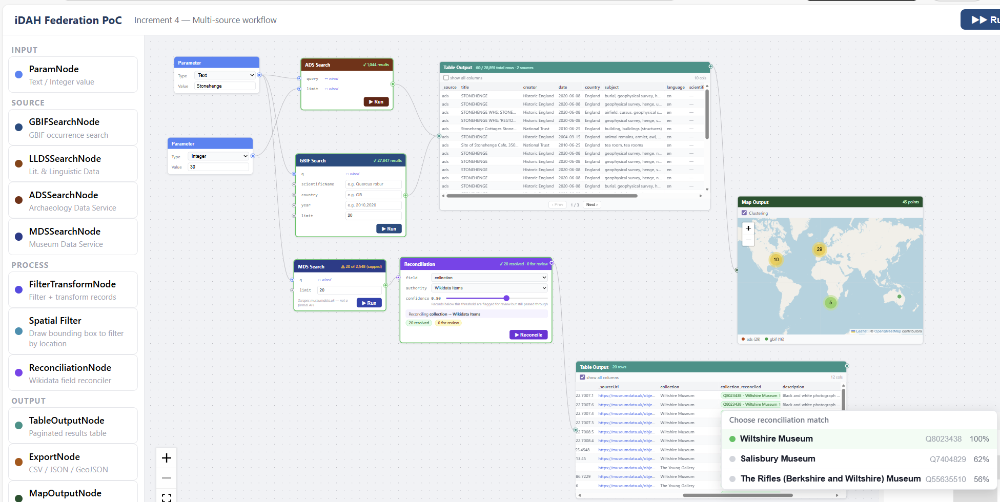

Everything runs in the browser except a thin Node proxy layer. The proxy exists for one reason: most of the data services do not send CORS headers, so the browser cannot call them directly. The proxy forwards requests to them, and in two cases drives a headless Chromium to get past bot protection or to render JavaScript.

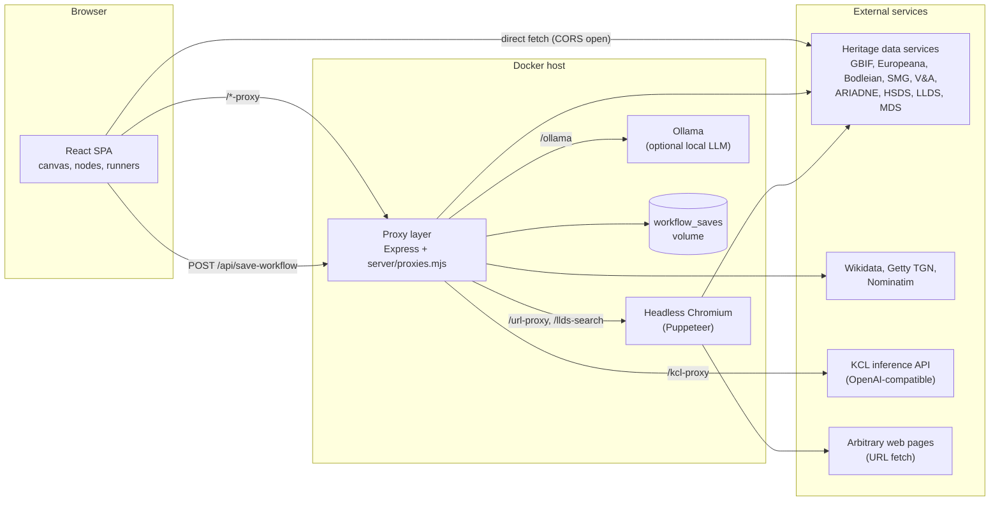

Three ideas carry the whole design and come up in every section:

1. **Records are the currency.** Every data source is adapted into `UnifiedRecord[]`. Every downstream node consumes and produces that same shape.
2. **Records live outside React state.** Node data holds configuration and status only. The records themselves sit in an in-memory store and are referenced by a version number.
3. **A node type is a key into several registries.** The component, the runner, the default factory, the sidebar entry and the colour are looked up by the same string, and the compiler checks that the registries agree.

## 2. The stack at a glance

| Layer | Technology | Where | Why it is there |
|---|---|---|---|
| UI | React 19, TypeScript 5.7 | `src/` | Single-page app, no router, no global state library |
| Canvas | `@xyflow/react` 12 | `src/App.tsx`, `src/nodes/` | Node editor: nodes, edges, handles, minimap, viewport |
| Build and dev server | Vite 6 | `vite.config.ts` | Bundles the SPA; in development also hosts the proxy layer on port 5174 |
| Tests | Vitest 4 + jsdom | `src/__tests__/` | 366 unit tests; no browser or component tests |
| Production server | Express 4, `http-proxy-middleware` 3 | `server/index.mjs` | Serves `dist/`, hosts the same proxy layer on port 3001, accepts workflow saves |
| Headless browser | Puppeteer 24 + system Chromium | `server/proxies.mjs` | Solves LLDS's Anubis proof-of-work; renders JavaScript pages for URL fetch |
| Document parsing | pdfjs-dist, DOMParser, `@mozilla/readability` | `src/utils/fileReaders.ts`, `htmlExtract.ts` | Local PDF/XML/HTML ingestion in the browser |
| Maps | Leaflet + markercluster | `MapOutputNode`, `SpatialFilterNode` | OpenStreetMap tiles, bounding-box drawing |
| LLM inference | KCL ARC API (hosted), Ollama (local) | `src/utils/kclConfig.ts`, `arc.ts`, runners | Per-record and aggregate prompting, evaluation, planning |
| Packaging | Docker (two-stage), Compose | `Dockerfile`, `docker-compose.yml` | One image with Chromium; optional Ollama and Cloudflare tunnel services |
| CI | GitHub Actions | `.github/workflows/ci.yml` | Lint, typecheck, test, build, secret scan on every push and PR |

There is no database, no authentication, and no server-side session. The server is stateless apart from the directory it writes saved workflows into.

## 3. Repository map

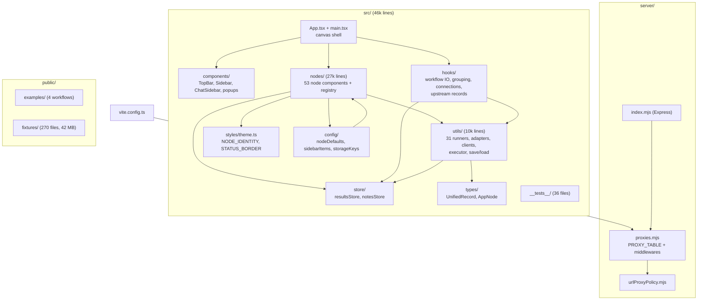

| Directory | Files | Lines | What lives there | Start with |
|---|---|---|---|---|
| `src/nodes/` | 59 | 26,747 | One `.tsx` per node type, the registry `index.ts`, the `withToolbar` wrapper, the shared `BackboneSearchNode` shell | `index.ts`, then `DeduplicateNode.tsx` (small, typical) |
| `src/utils/` | 79 | 9,854 | Runners (`run*Node.ts`), adapters (`*Adapter.ts`), service clients, the executor, save/load | `runWorkflow.ts`, `nodeRunners.ts`, `runDeduplicateNode.ts` |
| `src/components/` | 11 | 3,147 | Everything on screen that is not a node | `TopBar.tsx`, `Sidebar.tsx` |
| `src/hooks/` | 7 | 696 | Feature logic lifted out of `App.tsx` | `useWorkflowIO.ts`, `useUpstreamRecords.ts` |
| `src/store/` | 2 | 137 | The results store and the notes store | `resultsStore.ts` (58 lines, read it all) |
| `src/types/` | 3 | 358 | `UnifiedRecord`, `AppNode`, saved-search types | `UnifiedRecord.ts` |
| `src/config/` | 3 | 772 | Node default factories, sidebar palette, localStorage keys | `sidebarItems.ts` |
| `src/__tests__/` | 36 | 3,784 | Vitest suites | `runWorkflow.test.ts`, `runnerContract.test.ts` |
| `server/` | 6 | | Proxy layer, policy, Express entry, Docker entrypoint, type declarations | `proxies.mjs` |
| `public/` | 275 | | Example workflows, offline fixtures | `examples/manifest.json` |
| `docs/` | 9 | | This file, the engineering review, design notes, archive | |

One thing to notice in the diagram: `src/utils/` depends on `src/types/`, but `src/types/AppNode.ts` imports its 47 data interfaces *from the node component files*. So utilities depend on components through the type layer. The engineering review lists moving those interfaces into `src/types/` as backlog item B3.

## 4. Two ways to run it

The same proxy code serves two different hosts. `server/proxies.mjs` is plain ESM with no build step, so both the Vite dev server and Node can import it directly. The table of simple reverse proxies and the two custom middlewares are defined once and wired twice.

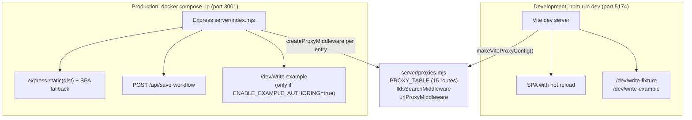

Differences that matter:

- **Saves only persist in production.** The Save button downloads a file *and* posts the workflow to `/api/save-workflow`. The dev server has no such route, and the client ignores the failure. In the container the file lands in `/app/data/workflows/`.
- **Example authoring is dev-only by default.** Author mode in the top bar (click the version text five times) can write a new example into `public/examples/`. The same route exists on the production server but is off unless `ENABLE_EXAMPLE_AUTHORING=true`, because it has no authentication.
- **URL fetch is deny-all in production unless configured.** `URL_PROXY_ALLOWLIST` lists the host suffixes `/url-proxy` may reach. Unset means "any public host" in development and "nothing" in production. The deployed instance sets it in `.env`.
- **Fixtures and examples are bind-mounted** in Compose, so editing them on the host changes the running instance without a rebuild.

## 5. The canvas shell

`App.tsx` is 262 lines and deliberately thin. It owns the React Flow instance and the small amount of state that is genuinely global, and delegates everything else.

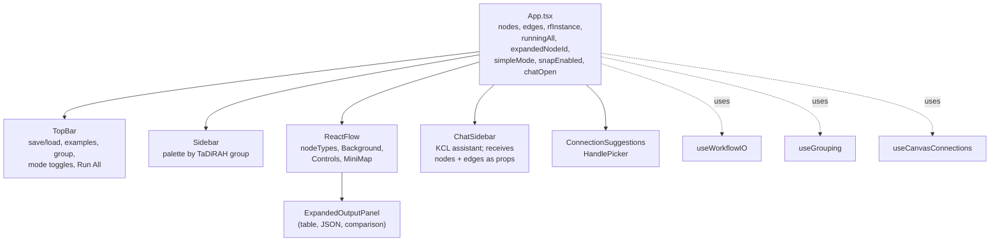

What each hook owns:

| Hook | Responsibility |
|---|---|
| `useWorkflowIO` | Save (download + POST), load from file or example, `applyWorkflow`, the `loadError` banner |
| `useGrouping` | Group and ungroup selected nodes; a debounced effect resizes a group to fit its children |
| `useCanvasConnections` | `onConnect` (enforces single-edge inputs such as `apiKey`), drag-and-drop from the sidebar, the suggestion and handle-picker popups that appear when an edge is dropped on empty canvas |
| `useUpstreamRecords` | Used by node components: merges records from every edge into the node's `data` handle and re-renders when an upstream `resultsVersion` changes |
| `useStaleResults` | Flags a node whose configuration changed after its last successful run |
| `usePromptRecipes` | Built-in and user-saved prompt templates for the LLM nodes (localStorage) |
| `useAutoGrowTextarea` | Cosmetic |

Two consequences of how the shell is built:

- **There is no `ReactFlowProvider` above `App`.** Only components rendered *inside* `<ReactFlow>` can use React Flow hooks. That is why `ChatSidebar` takes `nodes` and `edges` as props, and why `ExpandedOutputPanel` is rendered inside the canvas element.
- **Node data is configuration plus status, nothing else.** A node's `data` object holds the user's settings (`query`, `limit`, `model`, `dedupeField`), its run status (`status`, `statusMessage`, counts) and a `resultsVersion` integer. It never holds records. See section 8.

Persistent UI preferences are in localStorage under the keys in `src/config/storageKeys.ts` (`nfcs_simple_mode`, `nfcs_snap_grid`, `nfcs_author_mode`, the chat model and system prompt, prompt recipes). Two caches live outside that file: geocoding candidates (`geocache:v1:*`, 30-day TTL) and LLDS items (`idah_llds_items_v3`). Per-record notes are in memory only and travel with the workflow file.

## 6. Nodes

### 6.1 A node type is a key

`src/nodes/index.ts` exports `nodeTypes`, the map React Flow uses to pick a component for each node. Its keys are the node type strings. The type `NodeTypeId = keyof typeof nodeTypes` is derived from that object, and every other registry is checked against it with `satisfies`. Register the component first and the compiler tells you which registries still lack an entry.

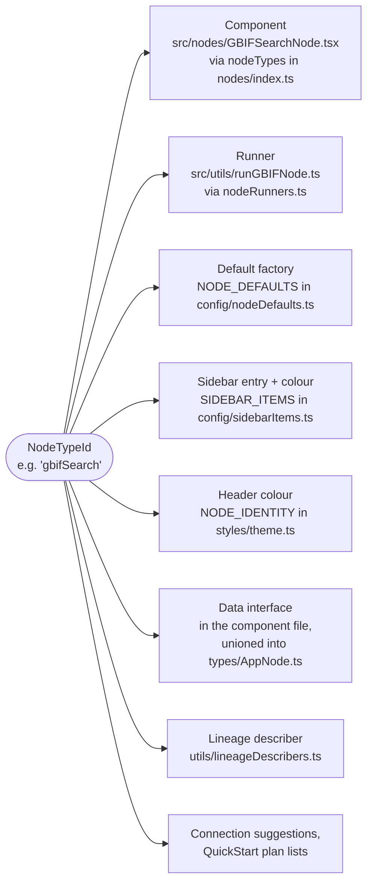

The type string is also a **file format**. Saved workflows and the four shipped examples store it verbatim. Renaming one would silently break every saved file, so the rule in `CONTRIBUTING.md` is: retire a node by removing it (the loader drops unknown types with a warning), never rename one. The same applies to node data keys and handle ids.

### 6.2 The 53 node types

Fifty-two appear in the sidebar, grouped by TaDiRAH research-activity vocabulary. The fifty-third, `group`, is created by the Group button. "Runner" means the node participates in Run All (section 7).

| Group | Types | Runner |
|---|---|---|
| Workflow Planning | `param`, `comment`, `quickStart` | `comment` only (a no-op) |
| Discovering | `gbifSearch`, `europeanaSearch`, `bodleianSearch`, `smgSearch`, `vaSearch`, `ariadneSearch`, `hsdsSearch`, `lldsSearch`, `mdsSearch` | all 9 |
| Gathering | `localFolderSource`, `localFileSource`, `sampleDataSource`, `urlFetch` | `sampleDataSource`, `urlFetch` (the two local sources need a user gesture for the File System API) |
| Enriching | `kclNode`, `kclField`, `ollamaNode`, `ollamaField`, `geocoding`, `smartGeocoder`, `reconciliation`, `wikidataEnrich`, `mergeByQID`, `htmlSection`, `xmlSection`, `quickNote` | all except `quickNote` |
| Analysing | `filterTransform`, `spatialFilter`, `deduplicate`, `evaluatorNode`, `smartFilter`, `sourceProfile`, `fieldDistribution` | first 4 |
| Visualising | `tableOutput`, `mapOutput`, `timelineOutput`, `timelineView`, `imageView`, `htmlPreview`, `quickView` | `mapOutput`, `timelineOutput`, `timelineView`, `imageView` |
| Disseminating | `export`, `jsonOutput`, `kclOutput`, `ollamaOutput`, `citation`, `saveSearch`, `loadSavedSearch`, `comparisonReport` | none |
| Experimental | `sparqlSearch`, `frameSenseSource` | `sparqlSearch` |

Simple mode (the default) hides the Experimental group and six advanced types (`smartFilter`, `smartGeocoder`, `frameSenseSource` and the three Ollama nodes).

### 6.3 Anatomy of a node

Open `src/nodes/DeduplicateNode.tsx` and `src/utils/runDeduplicateNode.ts` together. They are the smallest complete pair and the pattern every other node follows.

The **component** renders a header, a body of controls, a Run button, a status line and handles. It reads `data` for its settings, writes settings back with `updateNodeData`, reads upstream records through `useUpstreamRecords(id)` to populate dropdowns, and calls its runner on Run. It never fetches records itself. Every node is wrapped in `withToolbar`, which adds the floating duplicate and delete buttons.

The **runner** does the work: clears the node's previous results, reads its inputs, calls the service, stores the output, and sets a terminal status. Single Run and Run All call the same function, so they cannot disagree. (Seven older nodes still carry a second copy of their logic in the component for streaming or live preview. Backlog item B4 removes the duplication.)

Handles come in two kinds. **Data handles** (`data` in, `results` out) carry records. **Parameter handles** (`query`, `limit`, `apiKey`, and others) accept a `param` node so that one value can feed several nodes. Runners read parameter handles with `resolveParamEdge`; the executor ignores them when ordering nodes.

### 6.4 Two reuse mechanisms for search nodes

Nine search nodes share two pieces of infrastructure:

- **`BackboneSearchNode`** (`src/nodes/BackboneSearchNode.tsx`) is a config-driven component shell. A node passes a `BackboneSearchConfig` describing its filters (select, text, checkbox, range), its sort options and its footer, and the shell renders the whole node with the `query` and `limit` handles at fixed pixel offsets. Seven nodes are a ten-line wrapper around it. GBIF and Europeana stay separate because their handle layouts differ, and the handle offsets are a serialised contract pinned by `backboneHandles.test.ts`.
- **`makeSearchRunner`** (`src/utils/searchRunnerFactory.ts`) builds a runner for services with an Elasticsearch-style `?q&size&page` API: probe for the total, page through, adapt, cite, finish. ARIADNE and HSDS use it. The others have bespoke pagination (cursors, dual terminals, rate-limit backoff) and share only the helpers in `runnerHelpers.ts`.

### 6.5 Groups

Selecting two or more nodes and pressing Group wraps them in a `group` node (a real node type, `src/nodes/GroupNode.tsx`). Children get `parentId` and move with the group. Collapsing a group hides the children and **rewires every edge that crosses the boundary** to a proxy handle on the group, recording the original endpoints in `group.data.proxyEdges`.

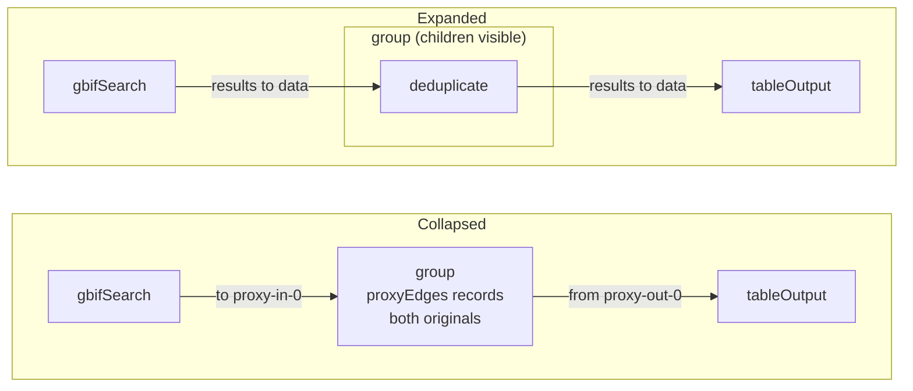

Anything that reasons about edge endpoints has to see through that rewrite. Two functions do so, and they differ:

- `resolveSavedEdges` in `src/utils/workflowIO.ts` resolves **both** ends. Save and load use it, which is how a credential `param` wired through a collapsed group still gets blanked on save.
- `resolveProxyEdges` in `src/utils/upstreamRecords.ts` resolves only the **source** end (`proxy-out-N`). Run All, `useUpstreamRecords` and lineage use it. A node *inside* a collapsed group that is fed from *outside* therefore sees its inbound edge pointing at the group during Run All, and gets no ordering, no records and no parameter. Expanding the group before Run All avoids it. This is recorded as backlog item B14.

## 7. Execution

### 7.1 The runner contract

```ts
type NodeRunner = (
  nodeId: string,
  getNodes: () => Node[],
  edges: Edge[],
  updateNodeData: (id: string, data: Record<string, unknown>) => void,
) => Promise<void>
```

A runner must **never throw** and must leave the node in `success`, `cached` or `error`. It must call `clearNodeResults(nodeId)` before any validation early-return, so a failed run cannot leave the previous run's records visible downstream. `src/__tests__/runnerContract.test.ts` checks this. `getNodes` is a function rather than a snapshot so that a runner in wave 2 reads the data a wave-1 runner wrote.

### 7.2 One node runs

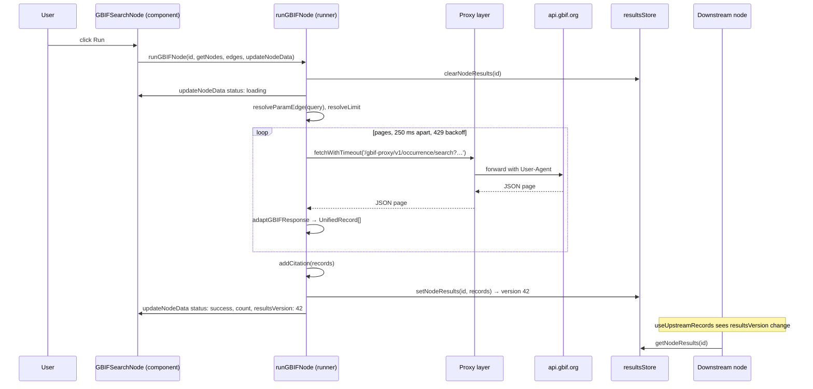

The sequence is identical for every runnable node. Only the middle changes: a local transform reads `collectUpstreamRecords(nodeId, edges)` instead of calling a service; an LLM node loops over records and calls `setNodeResults` after each one so partial results appear while it works.

### 7.3 Run All

`runWorkflow` in `src/utils/runWorkflow.ts` executes the whole canvas in dependency order using Kahn's algorithm: nodes with no unfinished upstream dependencies form a wave, the wave runs in parallel, and the loop repeats until nothing is left.

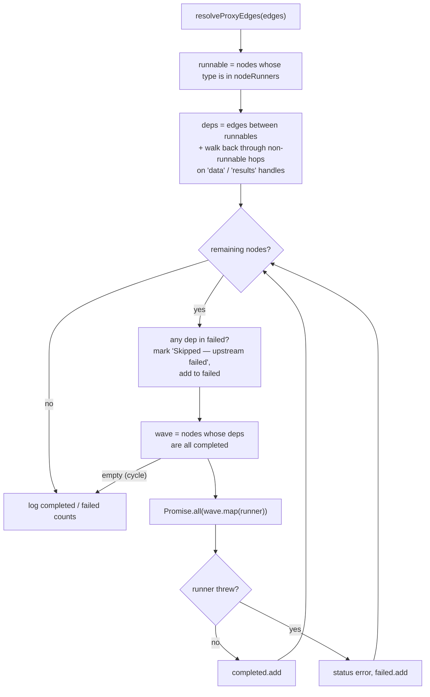

Points that are easy to get wrong:

- **Pass-through nodes count for ordering.** `tableOutput` has no runner, but Source → Table → KCL still orders KCL after Source, because the dependency walk follows `data` and `results` handles through non-runnable nodes.
- **Parameter handles do not count for ordering.** A `param` node is read at run time by whichever runner needs it.
- **Only a thrown exception marks a node failed.** Runners are written never to throw, so a runner that ends with `status: 'error'` and returns normally is counted as *completed*. Its dependants run anyway and see an empty input, because the runner cleared its results first. The user sees the red status on the failed node and empty outputs downstream, rather than a "skipped" cascade. This is backlog item B13.
- **Pass-through display nodes copy records from a React effect.** `tableOutput` writes its records to the store from a component effect, not a runner. A runnable node reading through it depends on that effect having fired between waves, which it does in practice because each wave awaits before the next begins.

Progress has no separate channel. Each runner reports through `updateNodeData` (status, message, counts) and the console (`[Workflow] wave — running: …`).

## 8. Data

### 8.1 UnifiedRecord

Every adapter produces `UnifiedRecord` (`src/types/UnifiedRecord.ts`). It is deliberately open: an index signature lets enrichment nodes add fields without changing the interface. Conformance is checked at runtime by `fixtureConformance.test.ts`, which reads every fixture file and asserts the top-level keys are known.

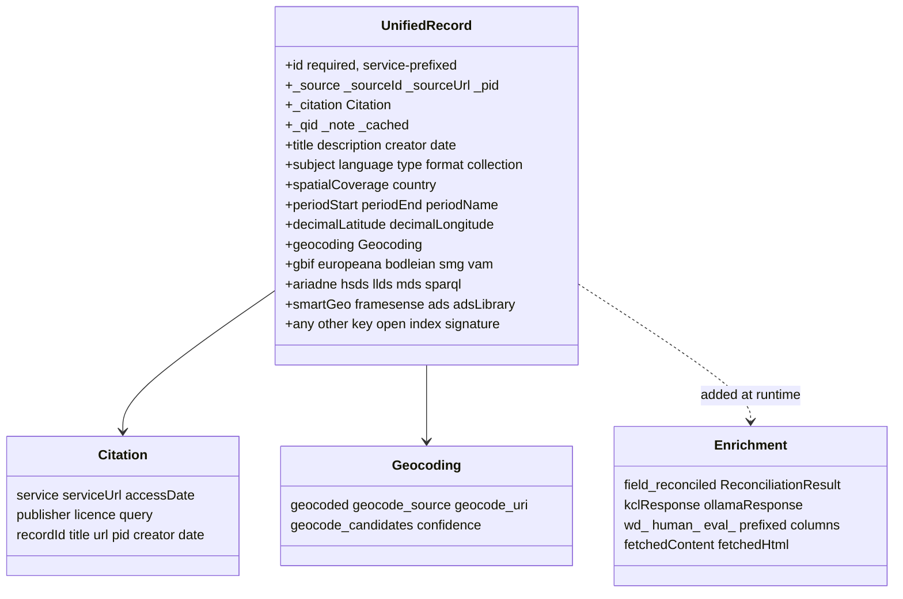

Rules worth internalising:

- **Namespaces hold the raw service fields.** `record.gbif.scientificName`, `record.europeana.rights`, `record.smg.manifest`. Readers use dot-notation field paths. The normalised top-level fields (`title`, `date`, `creator`, coordinates, period) are the cross-service subset.
- **Reconciliation writes `${field}_reconciled`** holding `{qid, label, confidence, status, candidates}` or an array of them. `isReconciledValue` in `reconciliationService.ts` is the only test for that shape.
- **`_citation` is stamped by runners**, not adapters, via `addCitation` in `citationUtils.ts`. The Citation node reads it.
- **`recordNormalise.ts`** upgrades records written by older versions (flat GBIF fields, stray Bodleian keys) when fixtures or saved searches are loaded. It is idempotent.

### 8.2 Adapters and clients

| Service | Adapter | Client call |
|---|---|---|
| GBIF | `gbifAdapter.ts` | `gbif.ts` + backoff loop in `runGBIFNode.ts` |
| Europeana | `europeanaAdapter.ts` (strips the API key Europeana appends to item URLs) | direct, in `runEuropeanaNode.ts` |
| ARIADNE, HSDS | `ariadneAdapter.ts`, `hsdsAdapter.ts` | `makeSearchRunner` |
| LLDS, MDS | `lldsAdapter.ts`, `mdsAdapter.ts` (HTML scraping) | `llds.ts` via `/llds-search`, `mds.ts` |
| Bodleian, SMG, V&A | inline in each runner | inline |
| Wikidata SPARQL | `sparqlAdapter.ts` | `sparqlEndpoints.ts` |
| Local files | `fileReaders.ts` produces `FileRecord` (a `UnifiedRecord` with `content`, `contentType`) | browser File APIs |

Seven of these adapters have no unit test (backlog B8). The fixture conformance test is the only thing that catches a drift in their output shape.

### 8.3 The results store

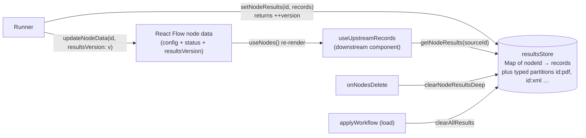

Why it is built this way: React Flow's `useNodes()` re-renders every subscriber when any node's data changes. If a search node put 300 records into its `data`, every node on the canvas would re-render on every result update, and saving a workflow would serialise megabytes. So records live in a plain module-level `Map` (`src/store/resultsStore.ts`, 58 lines) and node data carries only the version integer. The integer changing is the reactivity signal.

Two refinements:

- **Typed partitions.** Source nodes that produce several kinds of file (`localFolderSource`, `sampleDataSource`) write to `${id}:pdf`, `${id}:xml`, `${id}:text`, `${id}:image`, and expose one output handle per kind. `collectUpstreamRecords` and `useUpstreamRecords` pick the partition from the edge's `sourceHandle`.
- **Eviction.** Deleting a node clears its partitions. Loading a workflow clears the whole store. The store is also wiped by a Vite hot reload, which is why a node shows stale counts but no records after an edit in development.

### 8.4 Fixtures

Every search runner is wrapped in `withFixture` (`src/utils/fixtureUtils.ts`). When the node's 📦 toggle is on, the runner fetches `/fixtures/{nodeType}-{sanitised query}.json` instead of calling the service and marks the node `cached`. There are 234 such files covering nine services, plus two curated document collections for `sampleDataSource`. This is how workshops run offline and how the shipped examples work without API keys. The fixtures are 42 MB and are copied into `dist/` on every build (backlog B11).

## 9. External services and the proxy layer

### 9.1 Who is called and how

| Service | Base | Route | Notes |
|---|---|---|---|
| KCL inference (ARC) | `api.ai.create.kcl.ac.uk` | `/kcl-proxy/v1/…` | Bearer key; OpenAI-compatible chat completions and model list |
| Ollama | `OLLAMA_HOST` | `/ollama/api/…` | Local LLM; streaming chat |
| GBIF | `api.gbif.org` | `/gbif-proxy/v1` | Proxied to add a User-Agent and avoid 429s |
| Museum Data Service | `museumdata.uk` | `/mds-proxy` | Two-step HTML scrape, capped at 200 |
| LLDS (Oxford) | `llds.ling-phil.ox.ac.uk` | `/llds-search` | Puppeteer solves the Anubis proof-of-work; `/llds-proxy` exists in the table but nothing in `src/` uses it |
| Bodleian | `digital.bodleian.ox.ac.uk` | `/bodleian-proxy` | IIIF manifests feed ImageView |
| Science Museum Group | `collection.sciencemuseumgroup.org.uk` | `/smg-proxy` | IIIF |
| V&A | `api.vam.ac.uk` | `/vam-proxy/v2` | IIIF |
| HSDS | `hsds.ac.uk` | `/hsds-proxy` | Elasticsearch-style |
| ARIADNE | `portal.ariadne-infrastructure.eu` | **direct** | CORS open |
| Europeana | `api.europeana.eu` | **direct** | `wskey` query parameter |
| Wikidata reconciliation | `wikidata.reconci.link` | `/reconcile-proxy/en/api` | Batches of up to 200 values |
| Wikidata Query Service | `query.wikidata.org` | `/wdqs-proxy/sparql` | Proxy adds the descriptive User-Agent WDQS requires |
| Wikidata API | `www.wikidata.org/w/api.php` | **direct** | `origin=*` |
| Getty TGN | `vocab.getty.edu`, `www.getty.edu` | `/tgn-proxy`, `/getty-search-proxy` | Geocoding gazetteer |
| Nominatim | `nominatim.openstreetmap.org` | `/nominatim-proxy` | SmartGeocoder only |
| British National Bibliography | `bnb.data.bl.uk` | `/bnb-proxy` | Target has been offline since the British Library incident |
| Any web page | | `/url-proxy?url=…&js=true&wait=…` | Allowlist policy below |
| OSM tiles, pdf.js worker (unpkg), Google Fonts | | **direct** | Browser-side assets |

The fifteen simple routes are one `PROXY_TABLE` entry each in `server/proxies.mjs`: a prefix, a target, an optional path rewrite and optional headers. Adding a CORS-blocked service is one line there.

### 9.2 The URL fetch policy

`/url-proxy` fetches arbitrary pages for the URL Fetch node. An unrestricted version of this is a server-side request forgery hole (it could reach `http://ollama:11434` inside the Compose network, or a cloud metadata endpoint), so the middleware applies a policy at every step. The pure decision logic is in `server/urlProxyPolicy.mjs` and has its own test suite.

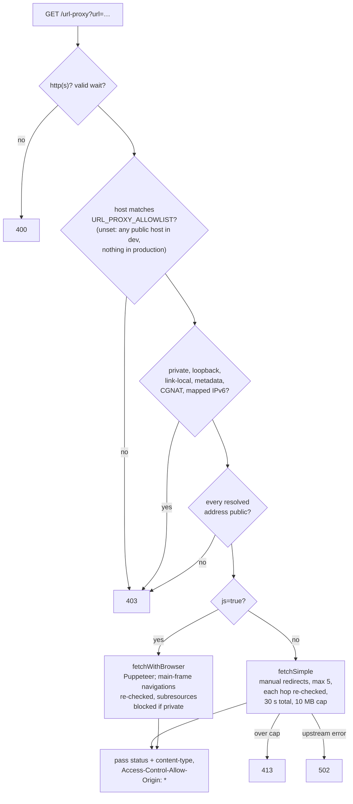

The Puppeteer browser is a lazily-launched singleton. Its `disconnected` handler resets the promise so the next request relaunches it. Chromium is installed from apt in the Docker image and Puppeteer's own download is skipped.

### 9.3 The LLM clients

Two providers, one interface shape (OpenAI-style chat messages):

- **KCL ARC** (`arc:nano`, `arc:lite`, `arc:nexus`, `arc:apex`). `src/utils/kclConfig.ts` holds the model list, the per-model content limits (`getContentMaxChars`: 12k, 32k, 64k characters) and the build-time default key. `src/utils/arc.ts` has a clean non-streaming client, but only the Evaluator uses it. The KCL node, the field node, the chat sidebar, SmartGeocoder and QuickStart each carry their own fetch. Backlog B2 is "one KCL client".
- **Ollama.** No shared client; each runner and component posts to `/ollama/api/chat` with `stream: true`, parsing newline-delimited JSON. Streaming is required because `stream: false` generates exactly `num_predict` tokens regardless of natural stopping.

## 10. Persistence

### 10.1 Workflow files

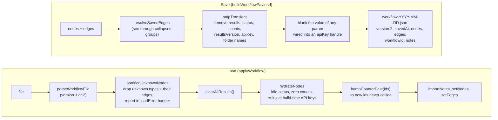

Credentials never reach a file: `apiKey` is a transient field and a `param` carrying a key is blanked. On load the build-time default is re-injected, so shipped examples work on an instance that was built with a key. `examplesNoSecrets.test.ts` and a CI grep fail the build if a key value appears under `public/`.

The `.nfcs.json` extension belongs to a different format: the **saved search** written by the SaveSearch node and read by LoadSavedSearch, which stores records and provenance rather than a canvas.

### 10.2 Other persisted things

| What | Where | Lifetime |
|---|---|---|
| Example workflows | `public/examples/*.json` + `manifest.json` | Shipped with the build; bind-mounted in Compose |
| Server-side copies of every save | `/app/data/workflows/` (named volume `workflow_saves`) | Until pruned by hand; carries `remoteIp` and `serverReceivedAt` |
| Per-record notes | `notesStore` (memory) and the `notes` key of the workflow file | Session, or the file |
| Prompt recipes, UI preferences | localStorage | Browser profile |
| Geocode candidates, LLDS item cache | localStorage | 30 days / until cleared |
| Results | `resultsStore` (memory) | Until the node is deleted, a workflow is loaded, or the page reloads |

## 11. AI features

The LLM nodes are where most of the product's novelty is and where the most duplicated code sits. The shapes to know:

- **Per-record inference** (`kclNode`, `ollamaNode`): a prompt template with `{{content}}` and any record field as a token, run once per record, output written to `kclResponse` or `ollamaResponse`. Vision-capable: image data URLs go in the `images` field, never in the prompt text.
- **Field inference** (`kclField`, `ollamaField`): one field in, one field out, in per-record or aggregate mode. Aggregate mode truncates each value *before* concatenation so the payload fits the model's limit.
- **Token substitution** is implemented once, in `src/utils/promptTemplates.ts`. Do not re-inline it.
- **Lineage.** `collectLineage` in `src/utils/lineage.ts` walks upstream from a node and `lineageToNarrative` renders the pipeline history as prose. A template containing `{{_lineage}}` gets that prose spliced in, so a model can be told how its input was produced. The chat sidebar appends the same narrative (capped at 1,500 characters) to its system prompt on every message. Design notes are in `docs/context-accrual.md`.
- **Evaluation pipeline.** `quickNote` (human reference and scores) → `evaluatorNode` (LLM-as-judge at temperature 0, per-criterion scores to `eval_*`) → `comparisonReport` (cards and an agreement matrix). The three span different sidebar groups but form one workflow.
- **QuickStart.** Describe a research question; `arc:nexus` proposes a graph of search, profile and output nodes; one click instantiates it. It depends on the hard-coded node knowledge in its prompt, so new node types need adding there (registration checklist step 12).
- **Credentials.** The KCL and Europeana keys are read from `VITE_*` environment variables at *build* time and compiled into the bundle. Anyone with the deployed JavaScript has them. That is acceptable for a workshop instance behind a tunnel and a rotation discipline, and it is the reason the engineering review's finding S5 and backlog B9 (keys held server-side) exist.

## 12. Build, test, CI and deployment

### 12.1 Scripts and gates

| Command | What it does |
|---|---|
| `npm run dev` | Vite with the proxy layer on 5174 |
| `npm run lint` | ESLint 9 flat config: real defects are errors, the known backlog (`exhaustive-deps`, `no-explicit-any`) is warnings |
| `npm run typecheck` | `tsc -b` across `tsconfig.app.json` (src) and `tsconfig.node.json` (vite config) |
| `npx vitest run` | 366 tests, jsdom |
| `npm run build` | typecheck then `vite build` to `dist/` |
| `npm start` | Express serving `dist/` on 3001 |

All four gates run in CI on Node 20 for every push to `main` and every pull request, followed by a gitleaks scan and a hard-failing grep for key patterns in `public/` and `src/`.

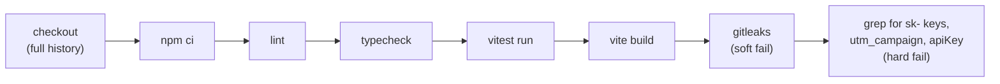

### 12.2 The Docker image

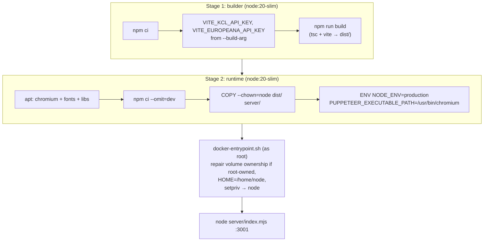

The entrypoint starts as root only so it can fix the ownership of a `workflow_saves` volume created by an older image, then drops to the unprivileged `node` user before Node starts. It never recurses into the bind-mounted examples directory.

### 12.3 Compose and the live instance

| Service | Image | Role | Started by |
|---|---|---|---|
| `app` | built from `Dockerfile` | The product on port 3001 | `docker compose up -d app` |
| `ollama` | `ollama/ollama` | Optional local LLM; reachable as `http://ollama:11434` from `app` | always, unless you name `app` explicitly |
| `cloudflared` | `cloudflare/cloudflared` | Named tunnel to the public hostname | `--profile tunnel` |

Volumes: `workflow_saves` → `/app/data`, `ollama_data`, `./public/fixtures` (read-only) and `./public/examples` (read-write) bind-mounted into `dist/`.

Environment variables, with the full meaning in `docs/engineering-review.md` section 7:

| Variable | When | Purpose |
|---|---|---|
| `VITE_KCL_API_KEY`, `VITE_EUROPEANA_API_KEY` | build | Default keys compiled into the bundle |
| `URL_PROXY_ALLOWLIST` | run | Host suffixes `/url-proxy` may fetch; required in production |
| `ENABLE_EXAMPLE_AUTHORING` | run | Expose the unauthenticated example-writing route |
| `OLLAMA_HOST` | run | Upstream for `/ollama` |
| `NODE_ENV` | run | `production` selects the deny-all proxy default |
| `CLOUDFLARE_TUNNEL_TOKEN` | run | Only with the `tunnel` profile |

Deploying a change is `git pull`, `docker compose build app`, `docker compose up -d app`.

## 13. Contracts you must not break

These are the places where a reasonable-looking change breaks something far away. They are also listed, with their tests, in `CONTRIBUTING.md`.

1. **Node type strings, node data keys and handle ids are a file format.** Saved workflows and the examples contain them verbatim. Remove, never rename.
2. **No record arrays in node data.** Records go in `resultsStore`; node data carries `resultsVersion`. Breaking this re-renders the whole canvas on every update and bloats saves.
3. **Runners never throw and clear before validating.** `runnerContract.test.ts`.
4. **Handle geometry on the shared search shell is pinned** by `backboneHandles.test.ts`. Moving a handle by a pixel changes which edge a saved file connects to.
5. **No credentials in files.** `apiKey` is transient; CI greps for key patterns; a leaked key is rotated, not scrubbed from history.
6. **`server/proxies.mjs` is the only place proxies are defined.** Both servers import it. Do not add a route to `vite.config.ts` alone.
7. **`isReconciledValue`, `renderCell`, `renderTemplate` and `fetchWithTimeout` are single implementations.** Several nodes used to carry private copies; the backlog is removing the last ones, not adding more.

## 14. Suggested onboarding path

**Day one, in this order:**

1. This document.
2. `CONTRIBUTING.md` (ten minutes).
3. `CLAUDE.md` sections "Results Store", "NodeRunner Contract", "Registration Checklist" and "Architectural Gotchas". Skim the node tables; come back to them as needed.
4. `docs/engineering-review.md` sections 3.4 and 6: what is known to be rough and the order to fix it.

**Three exercises that teach more than reading:**

1. Clone, `npm ci`, run all four gates, then `npm run dev`. Load the `stonehenge` example from the Examples menu and press Run All. Watch the console's `[Workflow] wave` lines and match them to the canvas.
2. Pick one node in that example. Open its component, its runner and its adapter. Set a breakpoint in the runner's `setNodeResults` call and follow the `resultsVersion` to the downstream node's `useUpstreamRecords`.
3. On a throwaway branch, add a trivial node (a "record counter" that writes `count` into each record) by following the registration checklist in `CLAUDE.md`. The compiler will tell you which registries you missed. Delete the branch.

**Good first backlog items** (from `docs/engineering-review.md` section 6): B8 (adapter tests, self-contained and teaches the data layer), B5 (one status union, touches many files shallowly), B12 (Node 22 in CI and Docker, one line in two files). The larger structural items, B1 through B4, should wait until one person has done the exercises above.

## Appendix: glossary

| Term | Meaning here |
|---|---|
| **TaDiRAH** | Taxonomy of Digital Research Activities in the Humanities. The sidebar groups (Discovering, Gathering, Enriching, Analysing, Visualising, Disseminating) are its top-level activities. |
| **UnifiedRecord** | The one record shape every node consumes and produces. |
| **Namespace** | A sub-object on a record holding a service's raw fields, e.g. `record.gbif`. |
| **Handle** | A React Flow connection point on a node. Data handles carry records; parameter handles carry a single value from a `param` node. |
| **Runner** | The function that executes a node type. Shared by the node's Run button and Run All. |
| **Wave** | One parallel batch in Run All: the nodes whose dependencies have all finished. |
| **Fixture** | A saved API response under `public/fixtures/` used in place of a live call. |
| **Lineage** | The upstream pipeline history of a node, rendered as prose for an LLM or the chat sidebar. |
| **Reconciliation** | Matching a text value to a Wikidata entity (QID) with a confidence score. |
| **QID** | A Wikidata identifier such as `Q39671` (Stonehenge). |
| **IIIF** | International Image Interoperability Framework. Manifests describe images; the Image API serves tiles. |
| **Anubis** | A JavaScript proof-of-work challenge that LLDS puts in front of its site; the proxy's headless browser solves it. |
| **ARC** | KCL's hosted inference service; model tiers `arc:nano`, `arc:lite`, `arc:nexus`, `arc:apex`. |
| **Proxy edge** | An edge rewired to a collapsed group's `proxy-in-N` or `proxy-out-N` handle, with the original endpoints kept in `group.data.proxyEdges`. |
| **Transient field** | A node data key stripped on save (results, status, counts, `apiKey`). |
