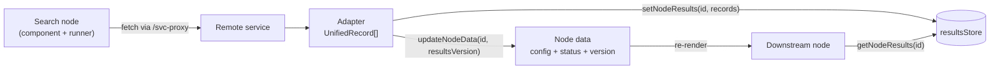

# Engineer quickstart

*A five-minute read for developers joining the iDAH Federation Workflow PoC. The full briefing, with diagrams of every layer, is `docs/architecture.md`.*

## 1. Why this exists

UK arts-and-humanities research data is spread across a dozen services: GBIF, Europeana, the Bodleian, the Science Museum Group, the V&A, ARIADNE, the Heritage Science Data Service, Oxford's language archive, the Museum Data Service, and more. Each has its own API, its own schema, and in most cases no CORS headers, so a researcher who wants to ask one question across several of them has to write code, or ask someone to.

This project, funded under the UKRI/AHRC Federation of Compute and Infrastructures programme, is the working demonstration that they do not have to. A researcher drags search nodes onto a canvas, wires them to filters, geocoders, Wikidata reconciliation, LLM enrichment, maps, tables and exports, and runs the whole graph. The proof of concept has been through several workshops and is now funded for consolidation into something a team can maintain and extend. That is where you come in.

## 2. The design idea

Three ideas organise the whole codebase. If you hold these, the rest is detail.

1. **Every source becomes the same record.** An adapter turns each service's response into `UnifiedRecord[]`: a few normalised fields (`id`, `title`, `date`, coordinates, period), the raw service fields under a namespace such as `record.gbif`, and an open index signature so enrichment nodes can add columns. Every downstream node reads and writes that one shape.
2. **Records live outside React state.** A node's `data` holds its settings and status only. The records sit in an in-memory `Map` (`src/store/resultsStore.ts`) and the node carries a `resultsVersion` integer. Bumping the integer is the signal that tells downstream nodes to re-read the store. This is what keeps a canvas with thousands of records responsive and keeps saved workflows small.
3. **A node type string is a key into every registry.** `'gbifSearch'` selects the component, the runner, the default factory, the sidebar entry, the colour and the lineage describer. `NodeTypeId` is derived from the component registry, and the other registries are checked against it, so a missing entry is a compile error. The same string is also serialised into saved workflows, so it is never renamed.



Single Run and Run All share one function per node, the **runner**. Run All (`src/utils/runWorkflow.ts`) orders the runners with Kahn's algorithm and executes each wave in parallel. A runner never throws and always clears its old results before doing anything else.

## 3. The stack

| Layer | Choice | Why |
|---|---|---|
| App | React 19 + TypeScript, single page, no router or state library | Everything is one canvas; the results store replaces global state |
| Canvas | `@xyflow/react` 12 | Nodes, edges, handles, minimap and viewport for free; we add 53 node components |
| Dev | Vite on port 5174 | Bundles the SPA and hosts the proxy layer during development |
| Prod | Express on port 3001, `server/index.mjs` | Serves `dist/`, hosts the same proxy layer, stores workflow saves |
| Proxies | `server/proxies.mjs`, shared by both servers | One table of reverse proxies for the CORS-blocked services, plus two custom routes |
| Headless browser | Puppeteer driving system Chromium, in the Docker image | One archive sits behind a JavaScript proof-of-work challenge; URL fetch can render JS pages |
| Quality gates | ESLint, `tsc`, Vitest (366 tests), `vite build`, in GitHub Actions | All four must pass on every PR; CI also greps for leaked keys |
| Deployment | Two-stage Dockerfile, Compose with optional Ollama and Cloudflare tunnel | One image; the entrypoint drops to a non-root user before Node starts |

There is no database and no authentication. The only server-side state is the directory that receives workflow saves.

## 4. Add a data-source node

The two newest search nodes, ARIADNE and HSDS, use both reuse mechanisms and are the template to copy. Each is one adapter, one eight-line runner config, one component config, and registry entries. Budget an afternoon.

1. **Proxy** (skip if the API sends CORS headers). Add one entry to `PROXY_TABLE` in `server/proxies.mjs`: a prefix, a target, a path rewrite, optional headers. Both servers pick it up.
2. **Adapter**, `src/utils/<svc>Adapter.ts`. A function from the API's response type to `UnifiedRecord[]`. Prefix `id` with the service name, map the normalised fields you can, put the whole raw hit under `record.<svc>`. Copy `ariadneAdapter.ts`.
3. **Runner**, `src/utils/run<Svc>Node.ts`. If the API is Elasticsearch-style (`?q&size&page` returning `{total, hits}`), the factory does everything:

   ```ts
   // src/utils/runHSDSNode.ts, trimmed: the real buildParams also copies the filter fields
   export const runHSDSNode = makeSearchRunner<HSDSSearchResponse>({
     service: 'HSDS', serviceUrl: 'https://hsds.ac.uk', publisher: 'Heritage Science Data Service',
     endpoint: '/hsds-proxy/data-catalogue-api/api/search', logTag: '[HSDS]', pageSize: 50,
     adapter: adaptHSDSResponse,
     buildParams: (d, resolve) => {
       const params: Record<string, string> = { sort: (d.sort as string) || '_score' }
       const q = resolve('query', 'inlineQuery')
       if (q) params.q = q
       return params
     },
   })
   ```

   Otherwise write a bespoke runner with the helpers in `runnerHelpers.ts` (`resolveParamEdge`, `resolveLimit`, `finishRunnerSuccess`, `finishRunnerError`) and follow the contract: clear results first, never throw, end in `success`, `cached` or `error`.
4. **Component**, `src/nodes/<Svc>SearchNode.tsx`. Declare a `BackboneSearchConfig` (title, theme from `NODE_IDENTITY`, sort options, a `filters` array of select, text, checkbox or range specs) and wrap the shared shell:

   ```tsx
   export function HSDSSearchNode(props: NodeProps) {
     return <BackboneSearchNode {...props} config={HSDS_CONFIG} />
   }
   ```

   The shell renders the query and limit handles, the Run button, status, fixture toggle and filters. Do not move its handle positions; a test pins them.
5. **Register.** Add the component to `src/nodes/index.ts` first, then let `npm run typecheck` tell you what else is missing: the runner in `src/utils/nodeRunners.ts` (wrapped in `withFixture`), the default factory in `src/config/nodeDefaults.ts`, the sidebar entry in `src/config/sidebarItems.ts`, the colour in `src/styles/theme.ts`, the data type in `src/types/AppNode.ts`, a one-line describer in `src/utils/lineageDescribers.ts`, and the suggestion sets in `src/components/ConnectionSuggestions.tsx`. If the AI planner should know about the node, the lists in `src/nodes/QuickStartNode.tsx`.
6. **Fixture.** Save one real response as `public/fixtures/<type>-<query>.json` (the node's download button does this). The 📦 toggle then runs offline, workshops work without the network, and `fixtureConformance.test.ts` checks your adapter output against the record shape. Add the new config's filter keys to `backboneHandles.test.ts`.
7. **Ship.** Run the four gates, one conventional commit, pull request to `main`. Add a row to the proxy table and node table in `CLAUDE.md`.

Three rules will bite if you forget them. Never rename a node type string, a data key or a handle id: they are a file format. Never put a record array in node data: use the store. Runners never throw: catch, set `error`, return.

Next: `docs/architecture.md` for how it all fits together, `CONTRIBUTING.md` for the gates, `docs/engineering-review.md` section 6 for what to work on.
